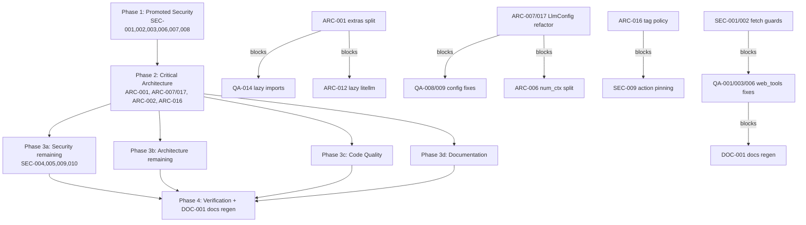

# Project Audit Report

> **Project**: PAR AI Core (`par_ai_core`) v0.5.8
> **Date**: 2026-07-09
> **Stack**: Python 3.11+ · LangChain · uv/hatchling · Playwright/Selenium · pytest (93% coverage)
> **Audited by**: Claude Code Audit System (four Fable subagents: architecture, security, code quality, documentation)

---

## Executive Summary

PAR AI Core is a well-documented, well-typed, well-tested library (93% line coverage, near-universal Google-style docstrings, `SecretStr` key hygiene) whose numbers mask several real defects: a documented scraper feature (`ScraperWaitType.TEXT`) calls a nonexistent Playwright API and is certified "working" by mocks; the LiteLLM context-size lookup silently never succeeds; and the LiteLLM provider cannot be configured from the environment at all. The most strategic problem is architectural — a "core" library that hard-requires all 38 dependencies (every provider SDK, two browser stacks, boto3, litellm) with no optional extras — and the most user-visible one is that the published API reference is four releases stale and misstates a security default. Remediating the 3 critical and 18 high issues is roughly 3–5 focused days of work; the medium/low backlog is another week. The codebase's consistency and test infrastructure make all of it low-risk to execute.

### Issue Count by Severity

| Severity | Architecture | Security | Code Quality | Documentation | Total |
|----------|:-----------:|:--------:|:------------:|:-------------:|:-----:|
| 🔴 Critical | 1 | 0 | 1 | 1 | **3** |
| 🟠 High     | 6 | 2 | 6 | 4 | **18** |
| 🟡 Medium   | 10 | 3 | 10 | 8 | **31** |
| 🔵 Low      | 7 | 5 | 9 | 5 | **26** |
| **Total**   | **24** | **10** | **26** | **18** | **78** |

> Cross-domain duplicates exist (e.g. ARC-004 ≡ QA-004, ARC-006 ≡ QA-016, ARC-002 ≡ QA-013, ARC-022 ≡ QA-012, ARC-021 ≡ QA-025, QA-026 ≡ DOC-001). Unique issues: ~71. Duplicates are cross-referenced below and must be fixed once, not twice.

---

## 🔴 Critical Issues (Resolve Immediately)

### [ARC-001] Monolithic mandatory dependency graph for a "core" library
- **Area**: Architecture
- **Location**: `pyproject.toml:39-79`
- **Description**: All 38 runtime dependencies are hard requirements — every langchain provider partner package, `playwright`, `selenium` + `webdriver-manager`, `boto3`/`botocore`, `praw`, `litellm`, `tavily-python`, `youtube-transcript-api`, `tiktoken`. No `[project.optional-dependencies]` extras exist. The code already lazy-imports provider SDKs inside `_build_*` methods in `llm_config.py`, but the manifest defeats that: a consumer who only wants Anthropic chat still installs Playwright, Selenium, AWS SDK, and a Reddit client.
- **Impact**: Hundreds of MB install weight, long dependency resolution, high version-conflict probability in consuming apps, and a needlessly large supply-chain surface. Undermines viability as a foundation dependency.
- **Remedy**: Reduce required deps to the true core (`langchain-core`, `pydantic`, `rich`, `requests`, …). Move each provider/feature behind extras: `par_ai_core[openai]`, `[anthropic]`, `[bedrock]`, `[web]` (playwright/selenium), `[search]` (tavily/praw/googleapi/serper), `[pricing]` (litellm), plus an `[all]` meta-extra. Guard imports with actionable `ImportError` messages ("install par_ai_core[web]").

### [QA-001] Playwright TEXT wait type calls a nonexistent API (`Locator.wait_for_text`)
- **Area**: Code Quality (overlaps ARC-011)
- **Location**: `src/par_ai_core/web_tools.py:339`; test that hides it: `tests/test_web_tools.py:592-608`
- **Description**: `await page.locator("body").wait_for_text(...)` — Playwright's Python `Locator` has no `wait_for_text` method. The `AttributeError` is swallowed by the broad `except Exception` at line 350, so `ScraperWaitType.TEXT` silently returns `""` for every fetch. Tests pass only because they mock the nonexistent method (`mock_page.locator.return_value.wait_for_text = AsyncMock()`).
- **Impact**: A documented feature is completely broken in production; users get empty results with no error. The test suite actively certifies the broken code.
- **Remedy**: Replace with `await page.wait_for_function("text => document.body.innerText.includes(text)", arg=wait_selector, timeout=timeout*1000)`. Constrain mocks with `spec=` so API drift fails tests.

### [DOC-001] Published API reference is four releases stale and documents security behavior incorrectly
- **Area**: Documentation (≡ QA-026)
- **Location**: `src/par_ai_core/docs/` (generated HTML, linked from README "Documentation" section)
- **Description**: The pdoc-generated HTML was last regenerated 2025-08-18, before versions 0.5.5–0.5.8. `apply_nest_asyncio` (added 0.5.5) appears zero times. Critically, 0.5.5 flipped the `ignore_ssl` default in web fetch functions from `True` to `False` — the published docs still describe the old, insecure default. They also predate the hashable `ParAICallbackHandler` fix, `configure_user_agent`, the gpt-5.1 default model changes, and the `get_runnable_config_by_llm_config` signature change.
- **Impact**: The README's only "Documentation" link sends every user to an API reference that misstates a security default and omits current public functions.
- **Remedy**: After the docstring fixes (DOC-004/007/008/009/018) and the web_tools fixes (QA-001/003) land, run `make docs`, commit the regenerated output, and add docs regeneration to the release checklist or CI.

---

## 🟠 High Priority Issues

### [SEC-001] SSRF and local-file read via unrestricted URL fetching
- **Area**: Security
- **Location**: `src/par_ai_core/web_tools.py:216-217` (`fetch_url`), reachable via `fetch_url_and_convert_to_markdown` (line 648) and `search_utils.py:196-197, 242-243` (`brave_search`/`serper_search` with `scrape=True`)
- **Description**: The only URL validation is that `urlparse(url).scheme` is truthy. No scheme allowlist (`file://`, `chrome://` pass) and no restriction on private/link-local ranges. Playwright's `page.goto()` and Selenium's `driver.get()` will render `file:///etc/passwd`, `http://169.254.169.254/latest/meta-data/`, or `http://localhost:8080/admin`. These functions are explicitly designed to be wired up as LLM tools, so model-generated (attacker-influenceable) URLs are an expected input — a practical SSRF/local-file-disclosure primitive (CWE-918).
- **Impact**: A planted instruction can make the app's LLM fetch cloud instance-metadata credentials or local secrets into model context.
- **Remedy**: Enforce a `{"http", "https"}` scheme allowlist in `fetch_url`; resolve hostnames and reject private/loopback/link-local/reserved ranges before fetching; document the DNS-rebinding caveat and the need for caller-side allowlists on untrusted URLs.

### [SEC-002] `ignore_ssl` / `--ignore-certificate-errors` disables TLS certificate validation
- **Area**: Security
- **Location**: `src/par_ai_core/web_tools.py:305` (Playwright `ignore_https_errors=ignore_ssl`), `web_tools.py:430-431` (Selenium flag)
- **Description**: `ignore_ssl=True` disables all certificate validation (CWE-295). This compounds SEC-001: `inject_credentials` (line 91) puts HTTP Basic credentials into the URL, and with TLS validation off those credentials travel to any man-in-the-middle.
- **Impact**: A user enabling `ignore_ssl` for one self-signed host silently accepts forged certs everywhere, including credentialed fetches.
- **Remedy**: Log a visible warning whenever `ignore_ssl=True` is active; refuse to inject credentials when SSL verification is disabled; document that the flag must never be combined with `http_credentials`.

### [ARC-002] Import-time global logging and excepthook mutation (≡ QA-013)
- **Area**: Architecture
- **Location**: `src/par_ai_core/par_logging.py:40,55-60`; `src/par_ai_core/__init__.py:14-15` (global `warnings.filterwarnings`)
- **Description**: At import, the module calls `rich.traceback.install(...)` (replaces `sys.excepthook` process-wide) and `logging.basicConfig(...)` (configures the root logger). `par_logging` is imported by nearly every module, so merely `import par_ai_core.llm_config` reconfigures the host application's logging and crash rendering.
- **Impact**: Host applications silently lose their own logging configuration and exception formatting — a classic library anti-pattern that is hard for consumers to diagnose.
- **Remedy**: Configure only the `"par_ai"` logger (attach handler + `propagate = False`) or expose an explicit opt-in `init_logging()`. Never call `basicConfig` or `traceback.install` at import in a library.

### [ARC-003] Undeclared direct dependency `googleapiclient`
- **Area**: Architecture
- **Location**: `src/par_ai_core/search_utils.py:56`
- **Description**: `from googleapiclient.discovery import build` is a top-level import, but `google-api-python-client` is absent from `pyproject.toml` — it arrives only transitively via `langchain-google-community`.
- **Impact**: If the transitive provider drops or gates that dependency, `import par_ai_core.search_utils` breaks with no change to this repo. Builds are correct today by accident, not by contract.
- **Remedy**: Declare `google-api-python-client` explicitly (inside the `[search]` extra per ARC-001), or defer the import into `youtube_search`/`youtube_get_comments`.

### [ARC-004] Callback context manager is not exception-safe (≡ QA-004)
- **Area**: Architecture / Code Quality
- **Location**: `src/par_ai_core/provider_cb_info.py:274-285`
- **Description**: `get_parai_callback` does `parai_callback_var.set(cb); yield cb; show_llm_cost(...); parai_callback_var.set(None)` with no `try/finally`. The ContextVar is registered globally with LangChain via `register_configure_hook`.
- **Impact**: Any exception inside the `with` block leaves the handler permanently installed — it silently accumulates usage for all subsequent LangChain runs in that context — and the cost summary is never printed, exactly when debugging a failure.
- **Remedy**: `try: yield cb` / `finally: parai_callback_var.set(None)`, with `show_llm_cost` in the `finally` (or gated on success).

### [ARC-005] Duplicated API-key validation diverges and breaks LiteLLM env config
- **Area**: Architecture
- **Location**: `src/par_ai_core/llm_utils.py:60-63`
- **Description**: `llm_config_from_env` re-implements provider key checking with its own exclusion list (`OLLAMA, LLAMACPP, BEDROCK`) instead of reusing `is_provider_api_key_set` (`llm_providers.py:383`), which additionally treats empty `env_key_name` (LiteLLM) as keyless. **Verified by execution**: `PARAI_AI_PROVIDER=LiteLLM` makes `llm_config_from_env()` raise `ValueError: " environment variable not set."` — an empty variable name in the message.
- **Impact**: The LiteLLM provider cannot be configured from the environment at all; the two key-checking paths keep drifting as providers are added.
- **Remedy**: Delete the local check; call `is_provider_api_key_set(ai_provider)`; raise using `provider_env_key_names[ai_provider]` in the message.

### [ARC-006] `num_ctx` conflates context-window size with max output tokens (≡ QA-016)
- **Area**: Architecture / Code Quality
- **Location**: `src/par_ai_core/llm_config.py:123-125` (definition); usages at `:396,413,443,459,500,526,554,594,621,658,691,707,761,772,810`
- **Description**: The field is documented as "Sets the size of the context window" (an Ollama concept), but for OpenAI, Azure, Anthropic, Groq, XAI, Deepseek, OpenRouter, Gemini, Bedrock, and Mistral it is passed as `max_tokens`/`max_tokens_to_sample` — the output cap, a semantically different parameter. The Anthropic builder even auto-sets it to `2 * reasoning_budget`.
- **Impact**: `num_ctx=128000` "to match the context window" becomes a 128k output cap (rejected by many APIs); leaving it unset yields provider defaults like 2048 that silently truncate completions. The public contract is misleading across 10 of 12 providers.
- **Remedy**: Split into `num_ctx` (Ollama context window) and `max_output_tokens` (all providers); map explicitly per provider; deprecate old behavior with a warning.

### [ARC-007] `LlmConfig` is a god object with hand-maintained parallel field lists (overlaps QA-008)
- **Area**: Architecture
- **Location**: `src/par_ai_core/llm_config.py:71-941`
- **Description**: One 870-line dataclass holds 26 fields mixing universal params with Ollama-only knobs (`mirostat`, `tfs_z`, `repeat_last_n`) and provider-specific ones, plus 12 `_build_*` factory methods dispatched through a 25-line if-chain (`_build_llm`, lines 823-855). `to_json()` (175), `clone()` (235), and `set_env()` (902) each manually enumerate every field. Builders mutate the config during build (`self.base_url` at 831, `self.extra_body` at 578, `self.num_ctx` at 650) — safe only because callers happen to clone first.
- **Impact**: Adding one field requires edits in 4+ places; a missed spot silently drops config on serialize/clone. Adding a provider means editing the class rather than registering a builder.
- **Remedy**: `clone()` via `dataclasses.replace`, `to_json()` via `dataclasses.asdict`; replace the if-chain with a `dict[LlmProvider, Callable]` builder registry; make `_build_llm` pure (compute effective base_url locally).

### [QA-002] `_get_model_context_size` metadata lookup is dead code — `getattr` on a TypedDict
- **Area**: Code Quality
- **Location**: `src/par_ai_core/llm_utils.py:160-171`
- **Description**: `get_model_metadata` returns LiteLLM's `ModelInfo`, a `TypedDict` (plain dict at runtime). `getattr(model_info, "max_input_tokens", None)` therefore always returns `None` (**verified**). Every model falls through to the hardcoded table; anything not in it (gpt-5.x, gemini-2.x, grok-4 — i.e. all current default models) gets the conservative 8192 default.
- **Impact**: `summarize_content` massively over-chunks large documents for modern 128k–2M context models, multiplying LLM calls and cost and degrading quality.
- **Remedy**: Use dict access: `model_info.get("max_input_tokens") or model_info.get("max_tokens")`. Test with a real `ModelInfo` dict, not an attribute-mock.

### [QA-003] Selenium SLEEP wait type is disabled dead code
- **Area**: Code Quality (overlaps ARC-024)
- **Location**: `src/par_ai_core/web_tools.py:463-465` (disabled branch), `:476,485` (unconditional sleeps)
- **Description**: `elif wait_type == ScraperWaitType.SLEEP and sleep_time > 0: pass  # time.sleep(sleep_time)` — the intended sleep is commented out, while lines 476/485 sleep unconditionally (`time.sleep(1)` then `time.sleep(sleep_time)`) for **all** wait types, so `NONE` still sleeps.
- **Impact**: Wait-type semantics are incoherent; every URL pays a minimum ~1+`sleep_time` second penalty regardless of configuration.
- **Remedy**: Delete the commented-out line; move the sleeps inside the appropriate branches; make `NONE` skip all sleeps. Add per-wait-type timing tests.

### [QA-005] `LlmConfig.from_json` raises bare `KeyError` for partial dicts
- **Area**: Code Quality
- **Location**: `src/par_ai_core/llm_config.py:224-233`
- **Description**: After filtering to known fields, the code unconditionally indexes `allowed_data["provider"]` and `allowed_data["mode"]`. A dict without `"mode"` raises `KeyError: 'mode'` (**verified**) even though `mode` has a dataclass default; missing `"provider"` raises `KeyError` instead of the documented `ValueError`.
- **Impact**: Round-tripping older serialized configs or hand-written dicts crashes with an unhelpful error; the documented `Raises: ValueError` contract is violated.
- **Remedy**: Guard mode conversion with `if "mode" in allowed_data`; raise `ValueError("provider is required")` when provider is absent.

### [QA-006] Systemic silent-failure error handling in I/O paths
- **Area**: Code Quality (overlaps ARC-011)
- **Location**: `src/par_ai_core/web_tools.py:251-256`; `src/par_ai_core/pricing_lookup.py:173-178`; `src/par_ai_core/search_utils.py:388-389`; 21 `except Exception` sites in `src/`, most without logging
- **Description**: `fetch_url` catches all exceptions and returns `[""] * len(urls)` (error printed only when `verbose=True`). `get_api_call_cost` returns `0` on any pricing-lookup exception. `youtube_get_comments` does `except Exception: break`, silently truncating results.
- **Impact**: Callers cannot distinguish "empty page" from "browser crashed", "free model" from "pricing lookup failed", or "no comments" from "API error". Cost tracking silently under-reports.
- **Remedy**: Log at warning level in all swallow sites (per-module `logger`); add a `raise_on_error: bool = False` escape hatch on `fetch_url`; log the failed model name once in pricing.

### [QA-007] `has_value` misuses `str.rstrip` as suffix removal
- **Area**: Code Quality
- **Location**: `src/par_ai_core/utils.py:377` (also depth comment mismatch at `:362-363`)
- **Description**: `search = search.rstrip(".00")` strips any trailing `.` and `0` *characters*, not the literal suffix. **Verified**: `"100".rstrip(".00")` → `"1"`, so searching for `100` matches the int `1` and fails to match `100`.
- **Impact**: Incorrect matching for any numeric search value ending in 0 — wrong results in both directions.
- **Remedy**: Use `search.removesuffix(".00")`. Align the "3 levels deep" comment with the `depth > 4` code.

### [DOC-002] README documents a nonexistent environment variable `PARAI_NUM_REDICT`
- **Area**: Documentation
- **Location**: `README.md` (Environment Variables block)
- **Description**: The `.env` template lists `PARAI_NUM_REDICT=`; the code reads `{prefix}_NUM_PREDICT`. The README's own prose later says "NUM_PREDICT" correctly.
- **Impact**: Users copying the template set a variable that is silently ignored; max-token configuration appears broken with no error.
- **Remedy**: Change to `PARAI_NUM_PREDICT=`.

### [DOC-003] `.env.example` has a wrong key name, missing provider keys, and keys from a different project
- **Area**: Documentation
- **Location**: `.env.example`
- **Description**: Contains `DEEP_AI_API_KEY` (code reads `DEEPSEEK_API_KEY`); omits `OPENROUTER_API_KEY`, `AZURE_OPENAI_API_KEY`, `OLLAMA_HOST`; includes many variables the library never reads (`DG_API_KEY`, `ELEVENLABS_API_KEY`, `VECTOR_STORE_URL`, `WEATHERAPI_KEY`, `GITHUB_PERSONAL_ACCESS_TOKEN`, `GITHUB_MODEL_ENDPOINT`, `XAI_ENDPOINT`, `PARAI_PRICING`, `PARAI_DISPLAY_OUTPUT`, `PARAI_YES_TO_ALL`, `PARAI_SHOW_TOOL_CALLS`); `LANGCHAIN_PROJECT=par_gpt` reveals it was copied from the downstream par_gpt project.
- **Impact**: Deepseek users configured via the example get a silent failure; users provision keys the library never uses.
- **Remedy**: Rebuild from variables the library actually reads: `provider_env_key_names` values, search keys (`TAVILY_API_KEY`, `JINA_API_KEY`, `BRAVE_API_KEY`, `SERPER_API_KEY`, `GOOGLE_CSE_ID`/`GOOGLE_CSE_API_KEY`, `REDDIT_*`), `OLLAMA_HOST`, tracing vars, and the `PARAI_*` set from `llm_config_from_env`.

### [DOC-004] `llm_config_from_env` docstring lists a variable that is never read and omits thirteen that are
- **Area**: Documentation
- **Location**: `src/par_ai_core/llm_utils.py` (`llm_config_from_env` docstring)
- **Description**: Documents `{prefix}_MAX_CONTEXT_SIZE` (does not exist; the actual variable is `{prefix}_NUM_CTX`) and omits `TIMEOUT`, `NUM_PREDICT`, `REPEAT_LAST_N`, `REPEAT_PENALTY`, `MIROSTAT`, `MIROSTAT_ETA`, `MIROSTAT_TAU`, `TFS_Z`, `TOP_K`, `TOP_P`, `SEED`, `REASONING_EFFORT`, `REASONING_BUDGET` — all read by the function.
- **Impact**: The canonical env-config reference misleads anyone relying on it.
- **Remedy**: Rewrite the docstring variable list to match the implementation exactly.

### [DOC-005] README documents environment variables the library never uses
- **Area**: Documentation
- **Location**: `README.md` ("Misc API" section and env template)
- **Description**: `WEATHERAPI_KEY` and `GITHUB_PERSONAL_ACCESS_TOKEN` are documented as required "for weather" / "for GitHub related tools", but no code reads them (source-wide grep). They belong to downstream projects.
- **Impact**: Misleads users into believing the library ships weather/GitHub tooling and into provisioning unnecessary credentials.
- **Remedy**: Remove both (or annotate as downstream-app variables).

---

## 🟡 Medium Priority Issues

### Architecture

- **[ARC-008] Provider registry duplicated across six parallel dicts plus a composed dataclass dict** — `src/par_ai_core/llm_providers.py:96-364`: `provider_base_urls`, `provider_default_models`, `provider_light_models`, `provider_vision_models`, `provider_default_embed_models`, `provider_env_key_names` are parallel dicts, then `provider_config` re-copies the same values into `LlmProviderConfig` objects (~115 lines) — two sources of truth, and `LlmProviderConfig` omits `base_url`. Adding a provider means touching 7 structures. *Remedy*: make `dict[LlmProvider, LlmProviderConfig]` (with `base_url` added) the single source; derive the legacy dicts as comprehensions.
- **[ARC-009] Fuzzy provider matching is enum-order dependent and contradicts its own docs** — `src/par_ai_core/llm_providers.py:199-227`: **verified** `get_provider_name_fuzzy("open")` returns `'OpenRouter'` while the docstring documents `"open"` → OpenAI. Reordering the enum silently changes resolution. *Remedy*: exact match first, then unique-prefix or raise on ambiguity; fix the docstring.
- **[ARC-010] Global singleton run registry correlates via a hijacked `llm.name` attribute** — `src/par_ai_core/llm_config.py:868,885,1102`; `provider_cb_info.py:167-173`: `build_chat_model` overwrites the model's public `name` with a UUID registered in the module-level `llm_run_manager`; the callback parses `config_id=` from tags; by-model lookups return the first of possibly many configs; eviction at 1000 entries silently loses correlation. *Remedy*: carry correlation exclusively through `RunnableConfig` metadata; scope the manager per callback/context or document the singleton lifecycle.
- **[ARC-011] Silent-failure data flow in web fetching, including a call to a nonexistent Playwright API** — `src/par_ai_core/web_tools.py:251-256,339,350-353`: blanket exception handling collapses per-page errors to `""`; the TEXT wait path (QA-001) has likely never worked and no test caught it because failures are swallowed. *Remedy*: covered by QA-001 + QA-006 (result objects or `raise_on_error`).
- **[ARC-012] Eager `litellm` import in the pricing layer and hardcoded "free provider" list** — `src/par_ai_core/pricing_lookup.py:29-30,165-166`: `litellm` (one of the heaviest packages) is imported at module top and `pricing_lookup` is imported eagerly by `provider_cb_info`/`llm_utils`, so nearly any use pays litellm's import cost. `get_api_call_cost` hardcodes `[OLLAMA, LLAMACPP, GROQ, GITHUB]` as zero-cost — Groq and GitHub Models have paid tiers. *Remedy*: defer litellm imports into functions; derive zero-cost from pricing data, not a hardcoded list.
- **[ARC-013] `utils.py` is a 929-line grab-bag with a duplicate HTML→Markdown pipeline** — `src/par_ai_core/utils.py` (whole module; `md()` at 145) vs `web_tools.py:524-645` (`html_to_markdown` via `html2text`, with fragile `html_content.replace("<pre", "``` <pre")` string surgery): two converter dependencies for one job; low cohesion. *Remedy*: split `utils.py` into cohesive modules; standardize on one HTML→Markdown implementation and drop the other dependency.
- **[ARC-014] Inconsistent result contracts and layering in the search subsystem** — `src/par_ai_core/search_utils.py` (all functions); `web_tools.py:113-156`: `web_tools.web_search` (Google CSE) returns typed Pydantic models while the six `search_utils` functions return untyped `list[dict]` with by-convention keys; Google search lives in the scraping module; `search_utils` reaches up into `llm_utils.summarize_content`, coupling search to LLM config. *Remedy*: single `SearchResult` Pydantic model; relocate `web_search`; accept an optional summarizer callable.
- **[ARC-015] Wheel ships generated documentation from inside the package tree** — `pyproject.toml:140-148`; `Makefile:126-129`; `src/par_ai_core/docs` (480 KB): `make docs` writes pdoc3 HTML into the package and the wheel includes `**/*.html`, `**/*.png`, `**/*.gif`, `**/*.md`. *Remedy*: generate docs outside `src/`, drop the include globs, gitignore the output.
- **[ARC-016] CI deletes and re-pushes existing release tags** — `.github/workflows/build.yml:189-209`: the `tag-version` job deletes and force-pushes `v${VERSION}` on every main push with an unchanged version. Mutable release tags break reproducibility/provenance and race the tag-triggered release/publish workflows. *Remedy*: no-op (or fail) when the tag exists; never delete published tags.
- **[ARC-017] Two-way environment serialization is maintained by hand in two modules** — `llm_config.py:902-941` (`set_env`) vs `llm_utils.py:35-147` (`llm_config_from_env`): independently maintained per-field blocks that already disagree (docstring's `MAX_CONTEXT_SIZE`; streaming default `False` vs dataclass `True`; ARC-005). Round-tripping does not reproduce the original config. *Remedy*: drive both directions from one table (field, env suffix, parser/serializer), e.g. dataclass field metadata.

### Security

- **[SEC-003] Google Gemini safety filters disabled by default (BLOCK_NONE)** — `src/par_ai_core/llm_config.py:692,708`: both Gemini builders hardcode `safety_settings={HARM_CATEGORY_UNSPECIFIED: BLOCK_NONE}`, silently disabling content safety for every consumer (CWE-1327). *Remedy*: make `safety_settings` a configurable `LlmConfig` field defaulting to provider-standard thresholds; require explicit opt-in for BLOCK_NONE.
- **[SEC-004] `.idea/` IDE directory committed to version control** — `.idea/` is tracked (appears in `git ls-files`); JetBrains files can leak local paths and data-source definitions (CWE-527). *Remedy*: `git rm -r --cached .idea` and add `.idea/` to `.gitignore`.
- **[SEC-005] Build/coverage artifacts and generated HTML tracked in repo** — `dist/`, `coverage.xml`, `.coverage`, `htmlcov/` present in the working tree (CWE-540): stale/sensitive content risk (absolute local paths in coverage XML, prebuilt wheels). *Remedy*: gitignore and untrack; rely on CI for release artifacts. (Overlaps ARC-015 for the shipped docs.)

### Code Quality

- **[QA-008] `LlmConfig` field shotgun surgery — 5 hand-maintained field lists** — `llm_config.py:175-267,902-941`; `llm_utils.py:35-147`: adding one field requires touching `to_json()` (27 keys), `clone()` (26 kwargs), `set_env()`, and `llm_config_from_env()` (110 lines). *Remedy*: same as ARC-007/ARC-017 (asdict/replace + table-driven env map) — fix once.
- **[QA-009] Duplicated, brittle reasoning-model prefix matching** — `llm_config.py:860-863,875-879`: `startswith("o1"/"o3"/"gpt-5.")` duplicated in `build_llm_model` and `build_chat_model`; misses `gpt-5`/`gpt-5-mini` (no dot) and `o4-mini`; note `provider_light_models` defaults to `"gpt-5-mini"`, which the check does **not** treat as reasoning. *Remedy*: single `_is_reasoning_model(name)` helper with explicit prefix tuple + parametrized test.
- **[QA-010] `serper_search` accepts and validates `days` but never uses it** — `search_utils.py:211-255`: `days` is validated then ignored (no freshness filter passed to `GoogleSerperAPIWrapper`); `type` shadows the builtin. *Remedy*: wire `days` into the Serper query (`tbs=qdr:`) or remove the parameter.
- **[QA-011] `youtube_search` ignores caller's `max_comments` count** — `search_utils.py:469`: `youtube_get_comments(youtube, video_id)` omits the max argument, so comment fetches always use `max_results=10`. *Remedy*: pass `max_results=max_comments`.
- **[QA-012] `display_formatted_output` duplicates `csv_to_table` and crashes on empty CSV (≡ ARC-022)** — `output_utils.py:244-253`: inline CSV branch raises uncaught `StopIteration` on empty content and Rich errors on ragged rows, while `csv_to_table` (line 69) already handles both. *Remedy*: `console.print(csv_to_table(content))`.
- **[QA-013] Library configures global logging and traceback hooks at import time (≡ ARC-002)** — `par_logging.py:38-58`; `__init__.py:14-15`. Fix once with ARC-002.
- **[QA-014] Inconsistent import strategy — `search_utils` eagerly imports every backend** — `search_utils.py:52-65`: `praw`, `googleapiclient`, `tavily`, plus the `llm_utils` → `litellm` chain at module level, whereas `llm_config.py`/`web_tools.py` deliberately lazy-import. *Remedy*: move per-engine imports inside their functions (coordinates with ARC-001 extras).
- **[QA-015] `accumulate_cost` dict branch has double-count and inconsistent totals** — `pricing_lookup.py:206-215`: both `prompt_tokens` and `input_tokens` are added (double-counts payloads carrying both conventions); `total_tokens` accumulates only one pair. *Remedy*: normalize the payload to one convention first, then accumulate once.
- **[QA-016] `num_ctx` passed as `max_tokens` to most providers (≡ ARC-006)** — fix once with ARC-006.
- **[QA-017] Blocking `input()` inside async Playwright fetch** — `web_tools.py:315-316`: `ScraperWaitType.PAUSE` calls synchronous `input()` in a coroutine, blocking the event loop and all parallel fetches. *Remedy*: `await asyncio.to_thread(input)` or restrict PAUSE to Selenium.

### Documentation

- **[DOC-006] README "What's New" is stale and duplicates the CHANGELOG** — current version is 0.5.8; "What's New" tops out at 0.5.7. *Remedy*: keep last 2–3 releases, link `CHANGELOG.md` for the rest.
- **[DOC-007] `LlmProvider` enum docstring omits four providers and misdescribes two** — `llm_providers.py`: omits `OPENROUTER`, `DEEPSEEK`, `LITELLM`, `AZURE`; describes GITHUB as "GitHub Copilot API" (it is GitHub Models) and XAI as "X.AI (formerly Twitter)". (Overlaps ARC-024.) *Remedy*: list all 14 members accurately.
- **[DOC-008] `LlmConfig` class docstring omits five configuration fields** — `llm_config.py`: Attributes section stops at `env_prefix`, omitting `fallback_models`, `format`, `extra_body`, `reasoning_effort`, `reasoning_budget`. *Remedy*: add the five attributes.
- **[DOC-009] `fetch_url` docstring states the wrong default for `wait_type`** — `web_tools.py`: says "Defaults to WaitType.IDLE" but the signature is `wait_type: ScraperWaitType = ScraperWaitType.SLEEP`; type name also wrong. Check `fetch_url_selenium` for the same drift. *Remedy*: correct default and type name.
- **[DOC-010] CHANGELOG missing released version 0.5.3 and all release dates** — git tags show `v0.5.3` was released but the CHANGELOG jumps 0.5.4 → 0.4.3; no entry carries a `YYYY-MM-DD` date despite claiming Keep a Changelog format. *Remedy*: add `[0.5.3]` entry; add dates from tag timestamps.
- **[DOC-011] README broken link and truncated sentence** — reversed markdown link `See (Environment Variables)[#environment-variables]`; Tavily bullet ends mid-sentence: "Tavily is much better than". *Remedy*: fix link syntax; complete or delete the sentence.
- **[DOC-012] README does not link `docs/architecture.md` / `docs/operations.md` and omits the Playwright driver install step** — first `fetch_url` call fails for new users with a missing-browser error and no documented resolution. *Remedy*: link both docs; add a `playwright install chromium` note to installation.
- **[DOC-013] Reddit search credentials undocumented** — `search_utils.py` reads `REDDIT_USERNAME`/`REDDIT_PASSWORD` in addition to the documented client id/secret; neither appears in README or `.env.example`. *Remedy*: document both as optional.

---

## 🔵 Low Priority / Improvements

### Architecture

- **[ARC-018] Redundant `strenum` dependency** — `requires-python >= 3.11` makes stdlib `enum.StrEnum` available, yet `llm_config.py:30`, `web_tools.py:46`, `pricing_lookup.py:34`, `output_utils.py:49` import from the third-party `strenum`. Drop the dependency.
- **[ARC-019] Invalid PEP 621 keys in `[project]`** — `pyproject.toml`: `url =` (line 7) and `packages =` (lines 80-82) are not valid `[project]` fields (URLs belong in `[project.urls]`; packages already duplicated in `[tool.hatch...]`). Currently ignored by hatchling, will fail stricter validators.
- **[ARC-020] Tooling version skew** — ruff `target-version = "py313"`, pyright `pythonVersion: "3.14"` vs `requires-python >= 3.11`: static analysis never checks the oldest supported interpreter. Set both to `3.11`.
- **[ARC-021] Facade drops parameters (≡ QA-025)** — `fetch_url_and_convert_to_markdown` (`web_tools.py:648-691`) forwards only `sleep_time`/`timeout`/`verbose`, silently ignoring proxy, credentials, wait type, headless, ignore_ssl, max_parallel.
- **[ARC-022] Duplicate CSV rendering paths (≡ QA-012)** — fix once with QA-012.
- **[ARC-023] Import-time environment reads** — `OLLAMA_HOST` (`llm_providers.py:41`) and `PARAI_LOG_LEVEL` (`par_logging.py:52`) are captured at import, so `load_dotenv()` called afterward (the common pattern, as in `__main__.py:34`) is ignored. Read at use time.
- **[ARC-024] Stale docs and dead code** — `LlmProvider` docstring lists 10 of 14 providers (≡ DOC-007); Selenium SLEEP branch is a `pass` with the sleep commented out (≡ QA-003); the console script `par_ai_core` points at a file self-described as a "Basic LLM example" (`__main__.py:1`); Makefile lacks `build`/`fmt` aliases for `package`/`format` (CLAUDE.md requires standard targets).

### Security

- **[SEC-006] Weak-hash helpers `md5_hash`/`sha1_hash` retained** — `utils.py:507-548`: already deprecated with warnings and unused in security paths; add `usedforsecurity=False` to the `hashlib` calls for FIPS environments and explicit intent.
- **[SEC-007] `id_generator` uses non-cryptographic `random`** — `utils.py:158-168`: fine for user-agent randomization; risky if downstream mints tokens with it. Document as non-security or switch to `secrets.choice`.
- **[SEC-008] Basic-auth credentials embedded in URL via `inject_credentials`** — `web_tools.py:91-110`, used at `:457` (Selenium path): URLs leak into logs/history/referrers. Prefer Playwright `http_credentials`; never log the credentialed URL.
- **[SEC-009] CI: third-party actions pinned to mutable refs** — `publish.yml:48`, `publish-dev.yml:45` use `pypa/gh-action-pypi-publish@release/v1` (moving branch); `Ilshidur/action-discord@0.4.0` (mutable tag) in `publish.yml:53`, `publish-dev.yml:53`, `release.yml:69` — supply-chain risk in workflows with `id-token: write`. Pin to full commit SHAs.
- **[SEC-010] `suppress_output` context manager can mask errors** — `utils.py:779-791`: redirects stdout/stderr to devnull; ensure it never wraps auth or fetch code paths (CWE-778).

### Code Quality

- **[QA-018] Naming defects** — `DECIMAL_PRECESSION` typo for "PRECISION" (`utils.py:60`); `b64_encode_image(image_path: bytes)` parameter named `image_path` holds raw bytes (`llm_image_utils.py:42`); `serper_search(type=...)` shadows the builtin (`search_utils.py:214`).
- **[QA-019] Dead code** — `sys.version_info >= (3, 11)` shims despite `requires-python >= 3.11` (`utils.py:842-846`, `time_display.py:22-25`); pointless `try: ... except Exception: raise` (`utils.py:839-848`); commented-out debug prints (`web_tools.py:173,293`; `provider_cb_info.py:186-189`); triple-nested `csv.Error` wrapping double-wraps its own message (`utils.py:467-489`).
- **[QA-020] Lint posture** — `ruff.toml` selects only `E4/E5/E7/E9/F/W/I` — no bugbear (`B`), no complexity (`C901`), no `UP`; `target-version = "py313"` disagrees with `requires-python >= 3.11` (≡ ARC-020). 31 unqualified `# type: ignore` comments in `src/` (prefer `# type: ignore[code]`).
- **[QA-021] Fake Chrome UA says "Mobile Safari" on desktop OS strings** — `user_agents.py` Chrome branch: easy bot fingerprint.
- **[QA-022] `get_files` semantics inverted vs. name** — `utils.py:270`: the `ext` parameter *excludes* matching files while the docstring says "filter by".
- **[QA-023] Depth-limit comment mismatch** — `utils.py:362-363`: comment says "don't go more than 3 levels deep", code allows `depth > 4` (fold into QA-007 fix).
- **[QA-024] Fragile markdown fence hack** — `web_tools.py:631-632`: `html_content.replace("<pre", "```<pre")` corrupts any text containing literal `<pre` and mismatches nested tags; use a soup-based transform (coordinates with ARC-013).
- **[QA-025] `fetch_url_and_convert_to_markdown` drops options (≡ ARC-021)** — fix once.
- **[QA-026] Committed generated docs can go stale (≡ DOC-001)** — `src/par_ai_core/docs/*.html` already documents the buggy `wait_for_text` code; regenerate after fixes and gate `make docs` on release.

### Documentation

- **[DOC-014] Architecture diagram uses ASCII art instead of Mermaid** — `docs/architecture.md` violates `docs/DOCUMENTATION_STYLE_GUIDE.md`; convert the module dependency diagram to Mermaid `graph TD`.
- **[DOC-015] Badge defects** — README alt text reads "Arch x86-63" (should be x86-64); no CI status badge despite `.github/workflows/build.yml`.
- **[DOC-016] README implies UV is required to consume the library** — add `pip install par_ai_core` as an alternative; scope UV to development.
- **[DOC-017] sdist manifest includes a file that does not exist** — `pyproject.toml` `[tool.hatch.build.targets.sdist]` lists `extraction_prompt.md`, absent from the repo. Remove the entry or restore the file.
- **[DOC-018] `ParAICallbackHandler.__init__` lacks a docstring** — `provider_cb_info.py`: the only genuinely public callable without one. Add a short Google-style docstring.

---

## Detailed Findings

> Every issue is fully described in the severity sections above (single source of truth).
> This section carries each audit agent's domain-level assessments, inventories, and verification notes.

### Architecture & Design (audit-architecture, Fable)

- **Verdict**: Overall architecture health **Fair**. Key concern: a "core" library that hard-requires every provider SDK, two browser-automation stacks, and litellm — with no optional extras — undermines its purpose as a lightweight foundation, and duplicated per-provider config/validation tables are already producing observable behavioral bugs (LiteLLM env config, fuzzy matching, free-provider pricing).
- **Empirically verified defects** (confirmed by execution, not just reading): ARC-005 (LiteLLM `ValueError` with empty var name), ARC-009 (`get_provider_name_fuzzy("open")` → `'OpenRouter'`), ARC-011/QA-001 (`Locator.wait_for_text` does not exist in Playwright's Python API).
- **Highlights**: genuine multi-provider abstraction with lazy provider imports in `_build_*` methods (the right foundation for the extras split); `py.typed` + near-universal annotations; concurrency awareness (`threading.Lock` in `LlmRunManager`/`ParAICallbackHandler`, bounded registry, semaphore-limited parallel fetching); ~5,000 lines of tests vs ~5,300 lines of source with a 3.11–3.14 × Ubuntu/macOS CI matrix; `SecretStr` throughout and `extract_url_auth` strips credentials from URLs.

### Security Assessment (audit-security, Fable)

- **Verdict**: Overall posture **Fair** — for a library (not a deployed service) with good secrets hygiene and clean dependencies, the main exposure is the web-fetching layer: no SSRF/scheme validation on functions explicitly intended as LLM tools makes SSRF and local-file disclosure a realistic attack path whenever URLs originate from model or user input.
- **Clean scans**: no real secrets found by token-format scanning (`sk-`, `AKIA`, `ghp_`, `AIza`, `xox`) across source, tests, CI; `.env` gitignored with `-rw-------` permissions; no `eval`/`exec`/`os.system`/`pickle`/`yaml.load` anywhere; `run_shell_cmd` uses `shlex.split` with `shell=False`; `gather_files_for_context` HTML-escapes paths and content; dependencies current (`urllib3 2.7.0`, `requests 2.34.2`, `cryptography 48.0.1`, `aiohttp 3.14.1`, `litellm 1.89.3`) with Dependabot active; first-party actions pinned; PyPI publish gated to manual dispatch with scoped `id-token: write`.

### Code Quality (audit-code-quality, Fable)

- **Verdict**: Overall code health **Good** (well-documented, well-typed, well-covered) — but broad exception swallowing combined with unconstrained mocks means genuinely broken features (Playwright TEXT wait, LiteLLM context-size lookup) run in production while the 93%-coverage suite stays green.
- **Technical debt summary**: 0 TODO/FIXME/HACK markers in `src/` (clean); 31 `# type: ignore` (heaviest: `llm_config.py` ×11, `pricing_lookup.py` ×8, `web_tools.py` ×7); files >500 lines: `llm_config.py` (1102), `utils.py` (929), `web_tools.py` (709); debt level **Moderate**.
- **Test coverage assessment**: 15 test files, ~258 test functions, 93.1% line coverage (lowest: `pricing_lookup.py` 88%, `output_utils.py` 88.9%, `provider_cb_info.py` 90.4%). Quality gaps: mocks not `spec=`-constrained (the `wait_for_text` mock is proof); no `conftest.py`/shared fixtures (env-var and mock setup copy-pasted); error paths in `get_api_call_cost` and `display_formatted_output` untested; wait-type timing behavior untested (how the disabled Selenium sleep survived).
- **Highlights**: exceptional docstring discipline; strong typing; parametrized provider-matrix tests and thread-safety tests; bounded eviction and deep-copied shared state; proper `DeprecationWarning` usage with named replacements.

### Documentation Review (audit-documentation, Fable)

- **Verdict**: Overall documentation health **Good**. Most impactful gap: the only API reference the README links to is ten months and four releases stale, still documenting the insecure pre-0.5.5 `ignore_ssl=True` default.
- **Inventory**: README present (Good — comprehensive, working quickstart that is a verbatim copy of `__main__.py` with every symbol verified accurate); API docs present but stale; `docs/architecture.md` and `docs/operations.md` present and sample-verified accurate on every claim checked (provider matrix, Azure API version); CHANGELOG present (missing dates and v0.5.3); CONTRIBUTING accurate; docstring coverage 130/134 public defs (97%; effectively 100% of true public API), consistent Google style.
- **Highlights**: internal builder docstrings document non-obvious behavior (reasoning budget minimum, forced temperature, auto-sized context); deprecations documented at both CHANGELOG and runtime-warning levels; breaking changes explicitly flagged (0.1.17 Google→Gemini rename).

---

## Remediation Roadmap

### Immediate Actions (Before Next Release)
1. **QA-001** — fix the broken Playwright TEXT wait and its mock-blinded test (feature is silently dead in production).
2. **SEC-001 / SEC-002** — add scheme/private-IP guards to `fetch_url` and warn on `ignore_ssl`; these functions are designed to be LLM-tool-facing.
3. **QA-002** — one-line fix restoring LiteLLM metadata lookup (direct cost impact on `summarize_content`).
4. **ARC-005** — one-line fix restoring LiteLLM env configuration.
5. **ARC-004/QA-004** — `try/finally` in `get_parai_callback` (state leak).
6. **DOC-002/003/004/005** — fix the env-var documentation set (silent misconfiguration for users).
7. **DOC-001** — regenerate the published API docs (after the docstring/code fixes above).

### Short-term (Next 1–2 Sprints)
1. **ARC-001** — extras split (`[web]`, `[search]`, `[pricing]`, per-provider extras) with guarded imports; coordinate ARC-003, ARC-012, QA-014.
2. **ARC-007/ARC-017/QA-008** — LlmConfig table-driven serialization + builder registry; then QA-005, QA-009, ARC-006/QA-016 on the new structure.
3. **ARC-002/QA-013** — remove import-time logging/excepthook mutation (behavioral change; document in CHANGELOG).
4. **QA-006** — logging in all exception-swallow sites + `raise_on_error` escape hatch.
5. **ARC-016 / SEC-009** — immutable release tags, SHA-pinned third-party actions.
6. **QA-003, QA-007, QA-010, QA-011, QA-012, QA-015, QA-017** — behavioral bug fixes.
7. **SEC-003** — configurable Gemini safety settings.
8. Remaining Medium documentation items (DOC-006–013).

### Long-term (Backlog)
1. **ARC-008** — single-source provider registry.
2. **ARC-010** — correlation via RunnableConfig metadata instead of `llm.name` hijack.
3. **ARC-013/ARC-014** — utils split, one HTML→Markdown pipeline, typed `SearchResult` contract.
4. **ARC-015** — move generated docs out of the wheel.
5. Low-priority hygiene: ARC-018–024, SEC-004–008, SEC-010, QA-018–025, DOC-014–018.
6. Test-suite hardening: `spec=`-constrained mocks, `conftest.py`, wait-type timing tests, error-path tests.

---

## Positive Highlights

1. **Exceptional documentation discipline** — every module has a real docstring; 97% of public defs carry complete Google-style docstrings with examples; internal builders document non-obvious behavior (reasoning budget minimums, forced temperatures).
2. **Strong typing** — `py.typed` marker, modern 3.11+ unions, pyright in the gate.
3. **93% test coverage with real depth** — parametrized provider-matrix tests, thread-safety tests, error-path tests for provider/mode mismatches, across a 3.11–3.14 × 2-OS CI matrix.
4. **Secret hygiene** — API keys in `SecretStr` everywhere, `.env` correctly ignored and permissioned, zero hardcoded secrets found by token scanning, credentials stripped from URLs by `extract_url_auth`.
5. **No shell-injection surface** — `shlex.split` + `shell=False`, no `eval`/`exec`/`pickle`/`yaml.load` anywhere.
6. **Concurrency awareness** — locks in shared-state classes, bounded registries, semaphore-limited parallel fetching, deep-copied returns.
7. **Lazy provider imports** — `_build_*` methods defer every provider SDK import to call time: the right foundation for the extras split.
8. **Proper deprecation practice** — `DeprecationWarning` with named replacements (`md5_hash`/`sha1_hash` → `sha256_hash`, `run_shell_cmd` → `run_cmd`) instead of silent removal.

---

## Audit Confidence

| Area | Files Reviewed | Confidence |
|------|---------------|-----------|
| Architecture | All 15 source modules + manifests + CI + Makefile; 3 defects verified by execution | High |
| Security | All 15 source modules, tests, manifests, lock file, CI workflows, tracked-file scan | High |
| Code Quality | All source + test files; 3 defects verified empirically; coverage.xml analyzed | High |
| Documentation | README, CHANGELOG, docs/, .env.example, generated HTML, docstring AST scan (134 defs) | High |

*All four agents ran with maximum-capability models and cross-verified key claims by execution rather than inspection alone.*

---

## Remediation Plan

> This section is generated by the audit and consumed directly by `/fix-audit`.
> It pre-computes phase assignments and file conflicts so the fix orchestrator
> can proceed without re-analyzing the codebase.
> **See `AUDIT-REMEDIATION-PLAN.md` for the step-by-step playbook per issue.**

### Phase Assignments

#### Phase 1 — Critical Security (Sequential, Blocking)
<!-- No Critical security issues exist. All rows below are promoted: they modify conflict files also targeted by Code Quality, so they must land before parallel execution. -->
| ID | Title | File(s) | Severity |
|----|-------|---------|----------|
| SEC-001 | SSRF/local-file guard in URL fetching | `src/par_ai_core/web_tools.py`, `src/par_ai_core/search_utils.py` | High (promoted) |
| SEC-002 | ignore_ssl TLS-bypass warning + credential refusal | `src/par_ai_core/web_tools.py` | High (promoted) |
| SEC-008 | Stop embedding basic-auth credentials in URLs / never log them | `src/par_ai_core/web_tools.py` | Low (promoted) |
| SEC-003 | Configurable Gemini safety settings (new LlmConfig field) | `src/par_ai_core/llm_config.py` | Medium (promoted) |
| SEC-006 | `usedforsecurity=False` on md5/sha1 helpers | `src/par_ai_core/utils.py` | Low (promoted) |
| SEC-007 | Document/repair `id_generator` randomness contract | `src/par_ai_core/utils.py` | Low (promoted) |

#### Phase 2 — Critical Architecture (Sequential, Blocking)
| ID | Title | File(s) | Severity | Blocks |
|----|-------|---------|----------|--------|
| ARC-001 | Optional-extras dependency split + guarded imports | `pyproject.toml`, `src/par_ai_core/search_utils.py`, `src/par_ai_core/web_tools.py`, `src/par_ai_core/pricing_lookup.py` | Critical | ARC-003, ARC-012, QA-014 |
| ARC-007 | LlmConfig serialization/builder-registry refactor (with ARC-017) | `src/par_ai_core/llm_config.py`, `src/par_ai_core/llm_utils.py` | High (promoted) | QA-005, QA-008, QA-009, ARC-006/QA-016, DOC-008 |
| ARC-002 | Remove import-time logging/excepthook mutation (≡ QA-013) | `src/par_ai_core/par_logging.py`, `src/par_ai_core/__init__.py` | High (promoted) | QA-013, DOC ops-guide updates |
| ARC-016 | Immutable release tags in CI | `.github/workflows/build.yml` | Medium (promoted) | SEC-009 |

#### Phase 3 — Parallel Execution

**3a — Security (remaining)**
| ID | Title | File(s) | Severity |
|----|-------|---------|----------|
| SEC-004 | Untrack `.idea/`, gitignore | `.idea/`, `.gitignore` | Medium |
| SEC-005 | Untrack build/coverage artifacts | `dist/`, `coverage.xml`, `.coverage`, `htmlcov/`, `.gitignore` | Medium |
| SEC-009 | SHA-pin third-party GitHub Actions (after ARC-016) | `.github/workflows/publish.yml`, `publish-dev.yml`, `release.yml` | Low |
| SEC-010 | Audit `suppress_output` usage constraints | `src/par_ai_core/utils.py` | Low |

**3b — Architecture (remaining)**
| ID | Title | File(s) | Severity |
|----|-------|---------|----------|
| ARC-003 | Declare `google-api-python-client` (inside ARC-001 extras) | `pyproject.toml`, `src/par_ai_core/search_utils.py` | High |
| ARC-004 | try/finally in `get_parai_callback` (≡ QA-004) | `src/par_ai_core/provider_cb_info.py` | High |
| ARC-005 | Reuse `is_provider_api_key_set`; fix LiteLLM env config | `src/par_ai_core/llm_utils.py` | High |
| ARC-006 | Split `num_ctx` vs `max_output_tokens` (≡ QA-016; after ARC-007) | `src/par_ai_core/llm_config.py` | High |
| ARC-008 | Single-source provider registry | `src/par_ai_core/llm_providers.py` | Medium |
| ARC-009 | Deterministic fuzzy provider matching | `src/par_ai_core/llm_providers.py` | Medium |
| ARC-010 | Correlation via RunnableConfig metadata, not `llm.name` | `src/par_ai_core/llm_config.py`, `src/par_ai_core/provider_cb_info.py` | Medium |
| ARC-011 | Web-fetch error contract (with QA-001/QA-006) | `src/par_ai_core/web_tools.py` | Medium |
| ARC-012 | Lazy litellm import; data-driven zero-cost detection | `src/par_ai_core/pricing_lookup.py` | Medium |
| ARC-013 | Split `utils.py`; single HTML→Markdown pipeline | `src/par_ai_core/utils.py`, `src/par_ai_core/web_tools.py` | Medium |
| ARC-014 | Typed `SearchResult` contract; relocate `web_search` | `src/par_ai_core/search_utils.py`, `src/par_ai_core/web_tools.py` | Medium |
| ARC-015 | Generated docs out of wheel/package tree | `pyproject.toml`, `Makefile`, `src/par_ai_core/docs/` | Medium |
| ARC-017 | Table-driven env serialization (fold into ARC-007) | `src/par_ai_core/llm_config.py`, `src/par_ai_core/llm_utils.py` | Medium |
| ARC-018 | Drop `strenum` for stdlib `enum.StrEnum` | 4 modules + `pyproject.toml` | Low |
| ARC-019 | Fix invalid PEP 621 keys | `pyproject.toml` | Low |
| ARC-020 | Align ruff/pyright target versions to 3.11 | `ruff.toml`, `pyrightconfig.json` | Low |
| ARC-021 | Forward full parameter set in markdown facade (≡ QA-025) | `src/par_ai_core/web_tools.py` | Low |
| ARC-023 | Read env vars at use time, not import time | `src/par_ai_core/llm_providers.py`, `src/par_ai_core/par_logging.py` | Low |
| ARC-024 | Dead code / stale docstrings / Makefile aliases | `src/par_ai_core/llm_providers.py`, `src/par_ai_core/__main__.py`, `Makefile` | Low |

**3c — Code Quality (all)**
| ID | Title | File(s) | Severity |
|----|-------|---------|----------|
| QA-001 | Fix Playwright TEXT wait + spec-constrained mocks | `src/par_ai_core/web_tools.py`, `tests/test_web_tools.py` | Critical |
| QA-002 | Dict access for LiteLLM ModelInfo | `src/par_ai_core/llm_utils.py`, tests | High |
| QA-003 | Coherent Selenium wait-type semantics | `src/par_ai_core/web_tools.py`, tests | High |
| QA-004 | (≡ ARC-004, fix once) | `src/par_ai_core/provider_cb_info.py` | High |
| QA-005 | Graceful `from_json` partial-dict handling | `src/par_ai_core/llm_config.py`, tests | High |
| QA-006 | Log all exception-swallow sites; `raise_on_error` option | `src/par_ai_core/web_tools.py`, `pricing_lookup.py`, `search_utils.py` | High |
| QA-007 | `removesuffix` in `has_value`; depth comment | `src/par_ai_core/utils.py`, tests | High |
| QA-008 | (fold into ARC-007) | `src/par_ai_core/llm_config.py`, `llm_utils.py` | Medium |
| QA-009 | Single `_is_reasoning_model` helper | `src/par_ai_core/llm_config.py`, tests | Medium |
| QA-010 | Wire or remove `days` in `serper_search` | `src/par_ai_core/search_utils.py` | Medium |
| QA-011 | Pass `max_comments` through `youtube_search` | `src/par_ai_core/search_utils.py` | Medium |
| QA-012 | Reuse `csv_to_table` in `display_formatted_output` | `src/par_ai_core/output_utils.py`, tests | Medium |
| QA-013 | (≡ ARC-002, fix once) | `src/par_ai_core/par_logging.py` | Medium |
| QA-014 | Lazy per-engine imports in search_utils (after ARC-001) | `src/par_ai_core/search_utils.py` | Medium |
| QA-015 | Normalize token payload before accumulation | `src/par_ai_core/pricing_lookup.py`, tests | Medium |
| QA-016 | (≡ ARC-006, fix once) | `src/par_ai_core/llm_config.py` | Medium |
| QA-017 | Non-blocking PAUSE wait in async path | `src/par_ai_core/web_tools.py` | Medium |
| QA-018 | Naming fixes (typo constant, param names, builtin shadow) | `utils.py`, `llm_image_utils.py`, `search_utils.py` | Low |
| QA-019 | Remove dead code and commented-out debug prints | `utils.py`, `time_display.py`, `web_tools.py`, `provider_cb_info.py` | Low |
| QA-020 | Broaden ruff rule set; qualify type-ignores | `ruff.toml`, `src/` | Low |
| QA-021 | Fix desktop Chrome UA "Mobile Safari" token | `src/par_ai_core/user_agents.py` | Low |
| QA-022 | Fix `get_files` ext semantics/docs | `src/par_ai_core/utils.py` | Low |
| QA-023 | (fold into QA-007) | `src/par_ai_core/utils.py` | Low |
| QA-024 | Soup-based pre-tag handling in html_to_markdown | `src/par_ai_core/web_tools.py` | Low |
| QA-025 | (≡ ARC-021, fix once) | `src/par_ai_core/web_tools.py` | Low |
| QA-026 | (≡ DOC-001, fix once — regenerate docs last) | `src/par_ai_core/docs/` | Low |

**3d — Documentation (all)**
| ID | Title | File(s) | Severity |
|----|-------|---------|----------|
| DOC-002 | Fix `PARAI_NUM_REDICT` → `PARAI_NUM_PREDICT` | `README.md` | High |
| DOC-003 | Rebuild `.env.example` from actual code reads | `.env.example` | High |
| DOC-004 | Correct `llm_config_from_env` docstring | `src/par_ai_core/llm_utils.py` | High |
| DOC-005 | Remove unused env vars from README | `README.md` | High |
| DOC-006 | Trim "What's New" to recent releases | `README.md` | Medium |
| DOC-007 | Complete `LlmProvider` docstring (14 providers) | `src/par_ai_core/llm_providers.py` | Medium |
| DOC-008 | Add 5 missing `LlmConfig` attributes (after ARC-007) | `src/par_ai_core/llm_config.py` | Medium |
| DOC-009 | Correct `fetch_url` wait_type default/type | `src/par_ai_core/web_tools.py` | Medium |
| DOC-010 | Add 0.5.3 entry + dates to CHANGELOG | `CHANGELOG.md` | Medium |
| DOC-011 | Fix reversed link + truncated sentence | `README.md` | Medium |
| DOC-012 | Link architecture/operations docs; Playwright install step | `README.md` | Medium |
| DOC-013 | Document Reddit credentials | `README.md`, `.env.example` | Medium |
| DOC-014 | Mermaid module-dependency diagram | `docs/architecture.md` | Low |
| DOC-015 | Fix badge typo; add CI badge | `README.md` | Low |
| DOC-016 | Add pip install path | `README.md` | Low |
| DOC-017 | Remove nonexistent sdist include | `pyproject.toml` | Low |
| DOC-018 | Docstring for `ParAICallbackHandler.__init__` | `src/par_ai_core/provider_cb_info.py` | Low |
| DOC-001 | Regenerate published API docs (**run last**, after all docstring + web_tools fixes) | `src/par_ai_core/docs/` | Critical |

### File Conflict Map
<!-- Files touched by issues in multiple domains. Fix agents must read current file state
     before editing — a prior agent may have already changed these. -->

| File | Domains | Issues | Risk |
|------|---------|--------|------|
| `src/par_ai_core/web_tools.py` | Security + Architecture + Code Quality + Documentation | SEC-001, SEC-002, SEC-008, ARC-011, ARC-013, ARC-014, ARC-018, ARC-021, QA-001, QA-003, QA-006, QA-017, QA-024, QA-025, DOC-009 | ⚠️ Highest-contention file — Phase 1 security first, then QA, then docstring |
| `src/par_ai_core/llm_config.py` | Security + Architecture + Code Quality + Documentation | SEC-003, ARC-006, ARC-007, ARC-010, ARC-017, ARC-018, QA-005, QA-008, QA-009, QA-016, DOC-008 | ⚠️ SEC-003 then ARC-007 restructure, then remaining QA/DOC |
| `src/par_ai_core/llm_utils.py` | Architecture + Code Quality + Documentation | ARC-005, ARC-017, QA-002, QA-008, DOC-004 | ⚠️ Read before edit |
| `src/par_ai_core/search_utils.py` | Security + Architecture + Code Quality | SEC-001, ARC-003, ARC-014, QA-006, QA-010, QA-011, QA-014, QA-018 | ⚠️ ARC-001 import restructure first |
| `src/par_ai_core/utils.py` | Security + Architecture + Code Quality | SEC-006, SEC-007, SEC-010, ARC-013, QA-007, QA-018, QA-019, QA-022, QA-023 | ⚠️ Phase 1 security edits first |
| `src/par_ai_core/provider_cb_info.py` | Architecture + Code Quality + Documentation | ARC-004, ARC-010, QA-004, QA-019, DOC-018 | ⚠️ Read before edit |
| `src/par_ai_core/llm_providers.py` | Architecture + Documentation | ARC-008, ARC-009, ARC-023, ARC-024, DOC-007 | ⚠️ ARC-008 restructure before DOC-007 docstring |
| `src/par_ai_core/pricing_lookup.py` | Architecture + Code Quality | ARC-012, ARC-018, QA-006, QA-015 | ⚠️ Read before edit |
| `src/par_ai_core/output_utils.py` | Architecture + Code Quality | ARC-018, ARC-022, QA-012 | ⚠️ Read before edit |
| `src/par_ai_core/par_logging.py` | Architecture + Code Quality | ARC-002, ARC-023, QA-013 | Single fix (ARC-002) covers all |
| `pyproject.toml` | Architecture + Documentation | ARC-001, ARC-003, ARC-015, ARC-018, ARC-019, DOC-017 | ⚠️ ARC-001 restructures deps section first |
| `src/par_ai_core/docs/` | Code Quality + Documentation | QA-026, DOC-001 | Regenerate once, last |
| `ruff.toml` | Architecture + Code Quality | ARC-020, QA-020 | Single edit covers both |

### Blocking Relationships
<!-- Explicit dependency declarations from audit agents.
     Format: [blocker issue] → [blocked issue] — reason -->
- ARC-001 → QA-014, ARC-003, ARC-012: the extras split converts top-level imports (praw, googleapiclient, playwright, litellm) into guarded lazy imports; line-level fixes written first would conflict.
- ARC-007 (with ARC-017) → QA-005, QA-008, QA-009, ARC-006/QA-016, DOC-008: the serialization/registry refactor rewrites the exact regions those fixes target; DOC-008 must document the post-refactor field set.
- ARC-002 → QA-013 (same issue), DOC ops-guide updates: the fix changes the library's observable logging contract; docs/examples update after, not before.
- ARC-016 → SEC-009: publish/release workflows key off tags; change tag mutability before editing publish workflows.
- SEC-001, SEC-002 → QA-001, QA-003, QA-006: the URL-validation guard changes `fetch_url` signatures/early-return paths; QA rewrites of the same functions must build on the guarded version.
- SEC-003 → ARC-006/QA-016, DOC-008: adds a `safety_settings` field to LlmConfig; subsequent LlmConfig work must include it.
- SEC-006 → QA-007, QA-019: security edit to `utils.py` hash functions lands before QA reformats the same file.
- DOC-004, DOC-007, DOC-008, DOC-009, DOC-018, QA-001, QA-003 → DOC-001/QA-026: regenerating the HTML API reference must run after docstring and web_tools fixes or it republishes incorrect content.
- QA-001 + QA-003 should be fixed together in one pass over `web_tools.py` + `tests/test_web_tools.py`.

### Dependency Diagram


