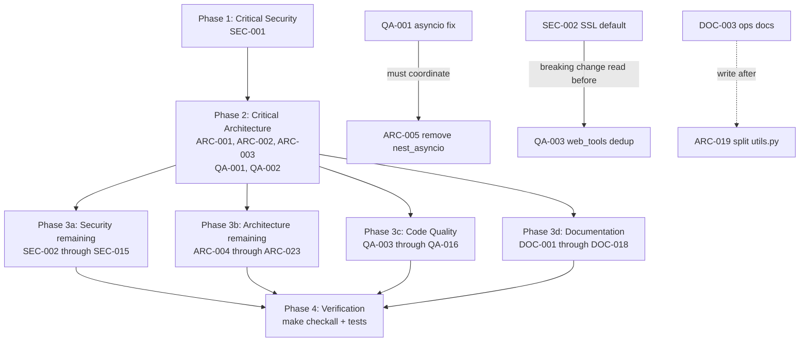

# Project Audit Report

> **Project**: PAR AI Core
> **Date**: 2026-03-05
> **Stack**: Python 3.11-3.13, LangChain, Pydantic, Playwright, Selenium, Typer, Rich, httpx, requests, litellm
> **Audited by**: Claude Code Audit System

---

## Executive Summary

PAR AI Core is a well-intentioned multi-provider LLM integration library with strong docstring culture, a working CI/CD pipeline, and clean import layering. However, the codebase carries **nine critical issues** across four domains: a `LlmConfig` dataclass that silently mutates its own fields during model construction (invalidating reuse), an unbounded `LlmRunManager` dictionary that leaks memory on every model invocation, a missing `tiktoken` dependency that will cause `ModuleNotFoundError` on fresh installs, live production API credentials sitting in a `.env` file on disk, and an asyncio anti-pattern in `web_tools.py` that silently fails in all production async servers. Remediating the top five critical issues (SEC-001, ARC-001, ARC-002, ARC-003, QA-001) would significantly improve both correctness and security with targeted, low-risk changes. On the positive side, the code is fully typed, uses Google-style docstrings consistently, and has a solid multi-platform CI matrix.

### Issue Count by Severity

| Severity | Architecture | Security | Code Quality | Documentation | Total |
|----------|:-----------:|:--------:|:------------:|:-------------:|:-----:|
| Critical | 3 | 1 | 2 | 3 | **9** |
| High     | 6 | 4 | 5 | 5 | **20** |
| Medium   | 7 | 5 | 5 | 5 | **22** |
| Low      | 7 | 5 | 4 | 5 | **21** |
| **Total**   | **23** | **15** | **16** | **18** | **72** |

> **Note on deduplication:** Several issues were identified independently by multiple agents (e.g., `LlmConfig` mutation appears in both Architecture and Code Quality; `JINA_API_KEY` KeyError appears in Security and Code Quality). In the Remediation Plan these are merged into a single fix task. The counts above reflect each agent's perspective; the plan below lists unique actions.

---

## Critical Issues (Resolve Immediately)

### [SEC-001] Live API Credentials in `.env` File
- **Area**: Security
- **Location**: `/Users/probello/Repos/par_ai_core/.env`
- **Description**: The `.env` file contains live, production-looking API keys for 14+ services including OpenAI, Anthropic, Groq, XAI, Google, Mistral, GitHub PATs (x 2), DeepAI, Deepgram, ElevenLabs, Jina, Brave, Serper, Tavily, and Reddit OAuth credentials. An AWS Account ID and a LangChain tracing key are also present.
- **Impact**: Any process, script, or developer with filesystem read access can extract and abuse every credential -- including GitHub Personal Access Tokens that provide repo write access. The file is correctly gitignored, but its presence on disk is a standing credential-theft risk.
- **Remedy**: Rotate all credentials immediately. Create a `.env.example` with placeholder values and commit it. Use a secrets manager for deployed environments.

### [ARC-001] `LlmRunManager` Uses Class-Level Shared Mutable State (Memory Leak)
- **Area**: Architecture
- **Location**: `src/par_ai_core/llm_config.py:881-882`
- **Description**: `_lock` and `_id_to_config` are class-level attributes, making all instances (and the module-level singleton) share the same lock and dictionary. The dictionary grows without bound -- one entry per `build_chat_model()` / `build_llm_model()` call with no eviction strategy.
- **Impact**: Unbounded heap growth in long-running applications. Any framework reusing a `LlmRunManager` instance across requests will eventually exhaust memory.
- **Remedy**: Move `_lock` and `_id_to_config` to `__init__` as instance attributes. Add a bounded LRU cache (e.g., `collections.OrderedDict` with max capacity) or an explicit `deregister_id` method.

### [ARC-002] `LlmConfig.build_chat_model()` / `build_llm_model()` Mutate `self`
- **Area**: Architecture / Code Quality
- **Location**: `src/par_ai_core/llm_config.py:773-791`, also `_build_anthropic_llm:588`
- **Description**: Both public build methods permanently overwrite `self.temperature`, `self.streaming`, `self.reasoning_effort`, and `self.num_ctx` on the config object before constructing the model. Calling `build_chat_model()` on an `o1` model sets `self.temperature = 1` and `self.streaming = False` -- permanently corrupting the original instance.
- **Impact**: Config objects cannot be safely reused or shared. Any code that stores a `LlmConfig`, builds a model, then inspects or clones the config will see silently wrong values.
- **Remedy**: At the top of `build_chat_model()` / `build_llm_model()`, clone `self` using the existing `clone()` method and perform all mutations on the clone. Never mutate `self` in build methods.

### [ARC-003] `tiktoken` Used at Runtime but Missing from `pyproject.toml`
- **Area**: Architecture
- **Location**: `src/par_ai_core/llm_utils.py:26`, `pyproject.toml` (absent)
- **Description**: `import tiktoken` is unconditional at the top of `llm_utils.py`. `tiktoken` does not appear anywhere in `pyproject.toml` dependencies. The silent fallback to `len(text) // 4` in `_estimate_tokens` only triggers if an exception is raised -- but the top-level import failure occurs first, breaking all of `llm_utils`.
- **Impact**: Downstream consumers who `pip install par-ai-core` on a clean environment get `ModuleNotFoundError: No module named 'tiktoken'` at first import, breaking all LLM utility functionality.
- **Remedy**: Add `tiktoken>=0.7` to `pyproject.toml` dependencies. Alternatively, use a lazy import with a meaningful error message.

### [QA-001] `loop.run_until_complete()` Called on a Running Event Loop
- **Area**: Code Quality
- **Location**: `src/par_ai_core/web_tools.py:225`
- **Description**: When `asyncio.get_running_loop()` succeeds, the code calls `loop.run_until_complete(...)` on the already-running loop. This is illegal in standard asyncio. The `nest_asyncio` patch in `__init__.py` is the only thing preventing a crash -- but `__init__.py` explicitly skips patching uvloop. In any production async server (FastAPI, Starlette) using uvloop, this call raises an uncatchable `RuntimeError` that is then silently swallowed by an outer `except Exception`, returning empty strings.
- **Impact**: Silent, invisible failures in all production async deployments.
- **Remedy**: Remove the `loop.run_until_complete` branch. Callers in async contexts should `await fetch_url_playwright(...)` directly. Provide explicit sync and async variants.

### [QA-002] Silent Swallowing of All File-Read Errors in `gather_files_for_context`
- **Area**: Code Quality
- **Location**: `src/par_ai_core/utils.py:874`
- **Description**: `except Exception as _: pass` silently ignores all errors (permission errors, encoding errors, I/O failures) when reading file contents. Failed files are simply omitted from the result with no indication.
- **Impact**: Callers receive silently incomplete context, potentially leading to incorrect AI responses with no diagnostic path.
- **Remedy**: At minimum, log the error with the file path.

### [DOC-001] README Quickstart Example Diverges from `__main__.py`
- **Area**: Documentation
- **Location**: `README.md:187,234` vs `src/par_ai_core/__main__.py:62`
- **Description**: The README example imports and calls `display_formatted_output` from `output_utils`; the real `__main__.py` uses `console_out.print(result.content)` with no such call.
- **Remedy**: Reconcile both files to use the same output path.

### [DOC-002] No CHANGELOG File
- **Area**: Documentation
- **Location**: Missing -- `CHANGELOG.md` does not exist
- **Description**: Version history is embedded inline in the README in non-sequential order (0.5.5, 0.4.2, 0.4.3, 0.4.1, 0.4.0, 0.5.4, 0.3.2...). Versions 0.5.0-0.5.3 are missing entirely. Heading "Whats New" is missing an apostrophe.
- **Remedy**: Create `CHANGELOG.md` following Keep-a-Changelog format in descending version order.

### [DOC-003] No Architecture or API Documentation Committed to the Repository
- **Area**: Documentation
- **Location**: Missing -- `docs/` directory contains only the style guide
- **Description**: `make docs` generates HTML into `src/par_ai_core/docs/` but those files are not committed. The README's documentation link may point to a missing GitHub blob. No human-authored architecture or operational document exists.
- **Remedy**: Create `docs/architecture.md` and `docs/operations.md`.

---

## High Priority Issues

### Architecture

**[ARC-004]** `DeprecationWarning` globally suppressed at import time -- `__init__.py:53`. `warnings.simplefilter("ignore", ...)` is process-global; any code importing this package loses all deprecation warnings from all libraries. *Remedy*: Scope filter to this package: `warnings.filterwarnings("ignore", ..., module="par_ai_core")`.

**[ARC-005]** `nest_asyncio.apply()` called at module import time -- `__init__.py:17-49`. Patching Python's event loop globally on import alters async behavior for the entire process without opt-in, and can cause subtle deadlocks. *Remedy*: Remove automatic patching; expose `par_ai_core.apply_nest_asyncio()` opt-in function.

**[ARC-006]** `os.environ["USER_AGENT"]` set as side effect of import -- `__init__.py:66`. Silently overwrites `USER_AGENT` in the process environment regardless of any existing value. *Remedy*: Pass user-agent string where consumed; expose a `configure()` function.

**[ARC-007]** `pricing_lookup` dict is ~280 lines of dead code -- `pricing_lookup.py:47-325`. `get_api_call_cost` was refactored to use `litellm.utils.get_model_info()`; the old dict is never referenced. Several keys use non-canonical names that would never match real model identifiers. *Remedy*: Remove entirely.

**[ARC-008]** `LlmConfig` is a God dataclass with provider-specific fields for all providers -- `llm_config.py:68-170`. Fields like `mirostat`, `mirostat_eta`, `tfs_z` (Ollama-only), `reasoning_effort` (OpenAI-only), `reasoning_budget` (Anthropic-only), `fallback_models` (OpenRouter-only) all live in one flat 22-field dataclass. *Remedy*: Introduce provider-specific config subclasses or a `provider_kwargs: dict[str, Any]` escape hatch.

**[ARC-009]** `LlmConfig.set_env()` mutates the process environment -- `llm_config.py:813-852`. Writes config values back into `os.environ`, polluting the process and creating race conditions in multi-threaded contexts. *Remedy*: Provide `to_env_dict()` returning a dict without side effects; remove or clearly warn about `set_env()`.

### Security

**[SEC-002]** SSL verification disabled by default -- `web_tools.py:190,292,405`. `ignore_ssl: bool = True` maps to `ignore_https_errors=True` in Playwright and `--ignore-certificate-errors` in Selenium. MITM attackers can intercept all fetched content. *Remedy*: Change default to `ignore_ssl: bool = False`.

**[SEC-003]** `os.environ[]` subscript raises `KeyError` on missing keys -- `search_utils.py:129,182`. `JINA_API_KEY` and `BRAVE_API_KEY` accessed via direct subscript instead of `.get()`. *Remedy*: Replace with `.get()` and raise descriptive `ValueError` if `None`.

**[SEC-004]** Third-party GitHub Actions pinned to mutable `@master` refs -- `.github/workflows/publish.yml:53`, `publish-dev.yml:53`, `release.yml:69`. Supply-chain compromise of `Ilshidur/action-discord` automatically runs in release pipelines with access to all secrets. *Remedy*: Pin to specific commit SHAs.

**[SEC-005]** MD5 and SHA1 exported as public API -- `utils.py:504-529`. Both are cryptographically broken. Downstream developers may use them for integrity verification. *Remedy*: Add `DeprecationWarning` and prominent docstring notes; remove from `__init__.py` exports.

### Code Quality

**[QA-003]** HTML-to-markdown logic duplicated between two functions -- `web_tools.py:546-667` and `:670-813`. ~80 lines of HTML processing are duplicated and already diverging (the two functions handle relative URL guards differently). *Remedy*: `fetch_url_and_convert_to_markdown` should call `html_to_markdown` per fetched page.

**[QA-004]** `except Exception as _` used to silently swallow errors in multiple locations -- `search_utils.py:305,399`, `utils.py:664`, `web_tools.py:222,516,526`, `pricing_lookup.py:452`. *Remedy*: Replace silent `pass` catches with at minimum a `logger.debug(...)` call.

**[QA-005]** `raise _` loses original traceback -- `utils.py:823`. Re-raising by name loses `__traceback__` context. *Remedy*: Replace with bare `raise`.

**[QA-006]** Azure API version hardcoded as magic string in three locations -- `llm_config.py:357,374,393`. Preview versions have short lifespans. *Remedy*: Extract to named constant and add as configurable `LlmConfig` field.

**[QA-007]** Test coverage at ~25% -- core modules nearly untested. `llm_utils.py` (10%), `web_tools.py` (11%), `user_agents.py` (9%), `search_utils.py` (19%), `llm_config.py` (28%). All `_build_*_llm` methods have essentially zero coverage. *Remedy*: Add mocked provider integration tests; target 70% on core modules; add `pytest-timeout`.

### Documentation

**[DOC-004]** Wrong environment variable name for OpenRouter -- `README.md:126`. Prose says `OPENROUTER_KEY`; correct name everywhere in code is `OPENROUTER_API_KEY`. *Remedy*: Fix line 126.

**[DOC-005]** `LlmConfig.gen_runnable_config` has no docstring -- `llm_config.py:265`. Called by both primary public build methods with no explanation of returned `RunnableConfig` structure or config_id lifecycle. *Remedy*: Add Google-style docstring.

**[DOC-006]** `PricingDisplay` enum lacks class and member docstrings -- `pricing_lookup.py:41-44`. Primary parameter to `get_parai_callback` (the main callback API) has no explanation of what `NONE`, `PRICE`, and `DETAILS` render. *Remedy*: Add class and member docstrings.

**[DOC-007]** ~12 `PARAI_*` environment variables undocumented in README -- `llm_utils.py:72,100+`. `PARAI_STREAMING`, `PARAI_USER_AGENT_APPID`, `PARAI_NUM_PREDICT`, `PARAI_REPEAT_PENALTY`, `PARAI_MIROSTAT*`, `PARAI_TFS_Z`, `PARAI_REASONING_EFFORT`, `PARAI_REASONING_BUDGET`, `PARAI_LOG_LEVEL`, `AZURE_OPENAI_API_KEY` all missing from README. *Remedy*: Add all to `.env` template in README.

**[DOC-008]** No contributing guide -- `CONTRIBUTING.md` does not exist. One sentence on contributing; GitHub issue template has irrelevant "Browser" field for a Python library. *Remedy*: Create `CONTRIBUTING.md`; fix issue template.

---

## Medium Priority Issues

### Architecture

**[ARC-010]** Provider configuration duplicated across five independent dicts -- `llm_providers.py:96-196`. Adding a provider requires updating six locations. *Remedy*: Consolidate into single `provider_config` dict with accessor helpers.

**[ARC-011]** `_build_llm()` uses a long if/if chain -- `llm_config.py:741-769`. Open/Closed violation. *Remedy*: Replace with `dict[LlmProvider, Callable]` dispatch table.

**[ARC-012]** `_estimate_tokens` always uses GPT-4 tokenizer for all models -- `llm_utils.py:201-226`. All three branches resolve identically to `tiktoken.encoding_for_model("gpt-4")`. Misleading dead branches; inaccurate for non-OpenAI models. *Remedy*: Remove false branching; use `cl100k_base` explicitly with explanatory comment.

**[ARC-013]** `get_provider_name_fuzzy` has undocumented suffix-match semantics -- `llm_providers.py:199-229`. Order-dependent, non-deterministic as enum grows. *Remedy*: Remove suffix match; document prefix-only semantics; add tests.

**[ARC-014]** `LlmRunManager.get_runnable_config_by_model` returns first match by model name only -- `llm_config.py:933-978`. Model names are not unique across providers (e.g., `gpt-4o` exists under both OpenAI and Azure). *Remedy*: Match on provider + model name.

**[ARC-015]** Dead commented-out code -- `pricing_lookup.py:475-490`, `llm_config.py:593-594`. *Remedy*: Remove all commented-out code.

**[ARC-016]** Python 3.14 support declared but that version is unreleased -- `pyproject.toml:25`, `ruff.toml:36`. Creates false compatibility promises and potential CI failures. *Remedy*: Remove 3.14 from classifiers and CI matrix until stable release.

### Security

**[SEC-006]** `run_shell_cmd` accepts arbitrary string input -- `utils.py:658-665`. Argument injection possible if user-controlled data reaches this function. *Remedy*: Accept `list[str]` instead; deprecate in favor of `run_cmd`.

**[SEC-007]** Credentials embedded in URLs via `inject_credentials` -- `web_tools.py:91-110`. Credential-bearing URLs appear in server access logs and (when `verbose=True`) console output. *Remedy*: Use Selenium's CDP `Network.setExtraHTTPHeaders` instead.

**[SEC-008]** No timeout on Jina HTTP request -- `search_utils.py:126-133`. `requests.get()` has no `timeout` parameter, violating the project's own CLAUDE.md standard. *Remedy*: Add `timeout=10`.

**[SEC-009]** `user_agent_appid` used as AWS User-Agent authentication token -- `.env:50`, `llm_config.py:670`. User-Agent headers appear in server logs unencrypted. *Remedy*: Use proper AWS IAM authentication.

**[SEC-010]** `LlmConfig.to_json()` may serialize credential-bearing `base_url` -- `llm_config.py:172-206`. The JSON output is used as LangChain metadata, which can appear in LangSmith traces. *Remedy*: Strip credentials from `base_url` before serialisation.

### Code Quality

**[QA-008]** `_estimate_tokens` misleading model-specific branches -- same underlying issue as ARC-012. Remove dead branching.

**[QA-009]** `llmConfig` parameter uses camelCase -- `llm_config.py:884`. PEP 8 violation. *Remedy*: Rename to `llm_config`.

**[QA-010]** `display_formatted_output` calls `print()` for PLAIN format -- `output_utils.py:241`. Bypasses the `console` parameter; PLAIN output is not capturable in tests. *Remedy*: Replace with `console.print(content, markup=False, highlight=False)`.

**[QA-011]** `on_llm_new_token` is a no-op `pass` with no comment -- `provider_cb_info.py:150-152`. Creates ambiguity about intent. *Remedy*: Add a comment explaining the intentional omission.

**[QA-012]** `jina_search` raises bare `Exception` -- `search_utils.py:145`. Callers cannot distinguish Jina HTTP errors from other exceptions. *Remedy*: Raise `requests.HTTPError` or a domain-specific `SearchApiError`.

### Documentation

**[DOC-009]** "Whats New" section has disordered version history -- `README.md:242-331`. Versions out of sequence; 0.5.0-0.5.3 missing; heading missing apostrophe. *Remedy*: Sort descending; fix heading. Full fix is DOC-002.

**[DOC-010]** `_build_*` private builder methods have only one-line docstrings -- `llm_config.py:272,334,445,470,495,517,551,573,605,656,711,741`. No documentation of env vars read, supported modes, or non-obvious behaviors (e.g., temperature forced to 1 for o1/o3 models). *Remedy*: Expand each docstring.

**[DOC-011]** Stale `audit.md` at project root (version 0.3.1, all items unchecked). Misleads new contributors; security issues listed as open are still unaddressed. *Remedy*: Delete or archive to `docs/archive/`; track open items as GitHub issues.

**[DOC-012]** No operational or deployment guide -- Missing `docs/operations.md`. No coverage of Playwright driver installation, Bedrock IAM setup, Azure endpoint configuration, or log-level management. *Remedy*: Create `docs/operations.md`.

**[DOC-013]** README lacks Table of Contents and style guide compliance -- `README.md`. Per the project's documentation style guide, documents over 500 words require a TOC and "Related Documentation" section. *Remedy*: Add TOC after badges block and related-docs section at the bottom.

---

## Low Priority / Improvements

### Architecture

**[ARC-017]** `LlmRunManager` docstring claims singleton pattern but nothing enforces it. After ARC-001 fix, enforce via `__new__` or remove the singleton claim.

**[ARC-018]** Azure API version magic string `"2025-03-01-preview"` appears three times -- `llm_config.py:357,374,393`. Extract to named constant.

**[ARC-019]** `utils.py` is a 905-line catch-all module with no coherent responsibility. Split into `file_utils.py`, `hash_utils.py`, `string_utils.py`.

**[ARC-020]** `par_logging.py` calls `logging.basicConfig()` at module import time -- library anti-pattern; may install duplicate handlers. Remove; provide opt-in `configure_logging()`.

**[ARC-021]** `build.yml` force-deletes and recreates release tags -- mutates published Git history. Fail the workflow if the tag already exists.

**[ARC-022]** `__main__.py` hardcodes OpenAI as the only provider -- poor example for a multi-provider library. Use `llm_config_from_env()` instead.

**[ARC-023]** `pytest-timeout` missing from dev dependencies. Add `pytest-timeout>=2.3.0` and `timeout = 30` to `[tool.pytest.ini_options]`.

### Security

**[SEC-011]** Google Gemini safety settings globally disabled -- `llm_config.py:625,641`. `BLOCK_NONE` applied to `HARM_CATEGORY_UNSPECIFIED` disables all content safety filters. Remove default override; let callers configure.

**[SEC-012]** Missing `.env.example` file -- `.gitignore` references `!.env.example` but the file does not exist, encouraging unsafe credential sharing.

**[SEC-013]** Bare exception swallowing in Selenium worker -- `web_tools.py:516`. Log exception type at DEBUG level even when not verbose.

**[SEC-014]** `LangChainConfig.api_key` stored as plain `str` -- `llm_providers.py:58`. Inconsistent with the rest of the codebase which uses `pydantic.SecretStr`.

**[SEC-015]** `pypa/gh-action-pypi-publish@release/v1` is a mutable branch ref -- `publish.yml:48`, `publish-dev.yml:45`. Pin to a specific tag or SHA.

### Code Quality

**[QA-013]** `type: ignore` used extensively on BeautifulSoup attribute access -- ~35 occurrences in `web_tools.py`. Assign to typed local variables to remove the need for suppression.

**[QA-014]** `LlmConfig.clone()` omits `user_agent_appid` field -- `llm_config.py:238-263`. Add `user_agent_appid=self.user_agent_appid` to the clone constructor.

**[QA-015]** Commented-out debug `print` / `console.print` statements throughout -- `search_utils.py` (9 locations), `pricing_lookup.py` (7 locations). Remove all.

**[QA-016]** `get_files` docstring confusing -- `utils.py:267`. Rewrite to: "Returns files that do not end with `ext`; if `ext` is empty, returns all files."

### Documentation

**[DOC-014]** `LlmConfig` attribute docstrings don't cross-reference `PARAI_*` env vars. Add "Env: `PARAI_<VARNAME>`" to each attribute note.

**[DOC-015]** `search_utils.py` module docstring references non-existent `get_llm` -- `search_utils.py:28`. `from par_ai_core.llm_config import get_llm` causes `ImportError`. Replace with correct `LlmConfig` usage example.

**[DOC-016]** `user_agents.py` browser version ranges are stale -- Chrome range 120-122 and Firefox 121-123 vs current Chrome 135+ and Firefox 136+. Update ranges and add maintenance note.

**[DOC-017]** `pyproject.toml` project description is a bare stub -- `description = "PAR AI Core"`. Write a one-sentence summary.

**[DOC-018]** GitHub issue template contains irrelevant "Browser" field -- `.github/ISSUE_TEMPLATE/bug_report.md`. Remove; add Python/OS/package-version fields.

---

## Detailed Findings

### Architecture & Design

PAR AI Core has a clean import graph with no circular dependencies and a sensible layering from `par_logging` (no internal imports) through `llm_providers` -> `llm_config` -> higher-level modules. The `py.typed` marker is correctly present and type annotations are consistent throughout. However, three critical architecture issues undermine production readiness:

1. **State mutation in build methods** (ARC-002) makes `LlmConfig` unsafe to reuse -- the single most impactful correctness bug.
2. **Unbounded `LlmRunManager` memory** (ARC-001) is a silent memory leak in any long-running service.
3. **Missing `tiktoken` dependency** (ARC-003) causes import failures on clean installs.

The `__init__.py` file performs three harmful side effects on import: suppressing all deprecation warnings globally, patching the asyncio event loop via `nest_asyncio`, and setting a process-wide `USER_AGENT` environment variable. These are anti-patterns for a library and should be replaced with opt-in functions.

The provider configuration system (`llm_providers.py`) duplicates data across five independent dictionaries for the same set of providers, requiring updates to six locations when adding a new provider. `LlmConfig` has grown into a 22-field God dataclass carrying Ollama-only, OpenAI-only, Anthropic-only, and OpenRouter-only parameters in a single flat structure.

### Security Assessment

The most urgent concern is the `.env` file containing live credentials for 14+ services (SEC-001). While it is correctly gitignored, its presence on disk with real keys is a standing credential-theft risk. **All credentials must be rotated immediately.**

Beyond credential management, SSL verification defaults to disabled across all web-fetching functions (SEC-002), creating a systematic MITM exposure. Third-party GitHub Actions are pinned to mutable `@master` refs (SEC-004), creating supply-chain risk. MD5 and SHA1 are exported as public API without deprecation warnings (SEC-005), risking misuse by downstream developers.

The codebase is broadly free from injection vulnerabilities -- `subprocess.run` uses `shell=False` throughout, and LangChain constructors receive API keys via `pydantic.SecretStr`. The CI pipeline correctly uses OIDC trusted publishing rather than stored PyPI tokens.

### Code Quality

The code's main technical debt centers on three areas: the `LlmConfig` mutation bug (also in Architecture), the asyncio anti-pattern in `web_tools.py` (QA-001), and severely low test coverage (QA-007, ~25% overall). The `web_tools.py` file has ~80 lines of HTML-processing logic duplicated between two functions that are already diverging (QA-003).

Exception handling is inconsistent: `except Exception as _: pass` appears in seven locations; `raise _` (which loses the traceback) appears in one; and `except Exception` blocks that silently return empty strings appear across the networking and file I/O code.

Docstring quality is notably high -- Google-style with `Args`/`Returns`/`Raises` sections present on virtually all public functions. Context managers are clean and well-composed. The `ParAICallbackHandler` is correctly thread-safe.

### Documentation Review

The README is well-structured with provider-signup links and a working quickstart, but diverges from the actual `__main__.py` entry point in its code example. ~12 `PARAI_*` configuration variables documented in source code are absent from the README. The version history in the README is out of sequence and missing several versions. No CHANGELOG, CONTRIBUTING guide, architecture document, or operational guide exists.

Docstring coverage is approximately 85-90% of the public API surface. Notable gaps are `gen_runnable_config`, `PricingDisplay` enum members, and the 12 `_build_*` private methods that contain the library's most complex logic.

---

## Remediation Roadmap

### Immediate Actions (Before Next Deployment)
1. **[SEC-001]** Rotate all credentials in `.env`; create `.env.example` with placeholders
2. **[ARC-002]** Fix `LlmConfig` build methods to operate on clones, not `self`
3. **[ARC-003]** Add `tiktoken` to `pyproject.toml` dependencies
4. **[QA-001]** Fix asyncio anti-pattern in `web_tools.py:225` -- provide sync/async variants
5. **[SEC-002]** Change `ignore_ssl` default to `False`

### Short-term (Next 1-2 Sprints)
1. **[ARC-001]** Add eviction to `LlmRunManager._id_to_config`; move to instance attributes
2. **[ARC-004/005/006]** Remove harmful side effects from `__init__.py`
3. **[ARC-007]** Remove dead `pricing_lookup` dict
4. **[SEC-004]** Pin all GitHub Actions to commit SHAs
5. **[QA-007]** Improve test coverage to 70% on core modules; add `pytest-timeout`
6. **[QA-003]** Eliminate HTML-to-markdown code duplication
7. **[DOC-001]** Reconcile README example with `__main__.py`
8. **[DOC-002]** Create `CHANGELOG.md`; sort version history
9. **[DOC-004]** Fix `OPENROUTER_KEY` to `OPENROUTER_API_KEY` in README
10. **[DOC-007]** Document all missing `PARAI_*` env vars in README
11. **[DOC-008]** Create `CONTRIBUTING.md`

### Long-term (Backlog)
1. **[ARC-008]** Refactor `LlmConfig` into provider-specific subclasses
2. **[ARC-009]** Replace `set_env()` with `to_env_dict()` (no side effects)
3. **[ARC-010]** Consolidate five provider config dicts into one
4. **[ARC-011]** Replace `_build_llm` if/if chain with dispatch table
5. **[DOC-003]** Author `docs/architecture.md` and `docs/operations.md`
6. **[QA-006/ARC-018]** Make Azure API version configurable via `LlmConfig` field
7. **[SEC-005]** Deprecate `md5_hash` and `sha1_hash` with warnings
8. **[ARC-019]** Split `utils.py` into focused modules

---

## Positive Highlights

1. **Zero circular imports and clean layering.** The import graph flows in one direction consistently across all 15 modules.

2. **Comprehensive Google-style docstrings across the public API.** All public functions and classes have docstrings with `Args`, `Returns`, and `Raises` sections. Module-level docstrings include purpose, key features, and worked usage examples. Coverage is ~85-90% of the public surface.

3. **Fully typed with `py.typed` marker shipped.** The package correctly ships `py.typed`, enabling downstream users to benefit from pyright/mypy. Annotations use `|` union syntax and built-in generics consistently.

4. **Thread-safe callback handler.** `ParAICallbackHandler` correctly uses `threading.Lock` on all shared state mutations and correctly implements `__hash__`/`__eq__` by identity for safe use in LangChain's callback-merging logic.

5. **Well-structured CI/CD with multi-platform matrix.** Tests across Ubuntu and macOS, Python 3.11-3.13, and x64/arm64. Format, lint, typecheck, and tests run before packaging, with coverage upload and automated version tagging.

6. **OIDC trusted publishing for PyPI releases.** The publish workflow uses `id-token: write` (OIDC) rather than a stored `PYPI_TOKEN`, eliminating a long-lived secret from CI.

7. **Clean use of context managers.** `get_parai_callback`, `timer_block`, `add_module_path`, and `catch_to_logger` cleanly encapsulate setup/teardown with `@contextmanager`. Idiomatic and easy to use correctly.

8. **Complete Makefile with all required targets.** All standard targets (`build`, `test`, `lint`, `fmt`, `typecheck`, `checkall`) present with `make help` annotations and correct `.PHONY` declarations.

---

## Audit Confidence

| Area | Files Reviewed | Confidence |
|------|---------------|-----------|
| Architecture | 15 source + config files | High |
| Security | 15 source + 4 workflow + .env files | High |
| Code Quality | 15 source + 15 test files | High |
| Documentation | README + all .md + docstrings sampled | High |

---

## Remediation Plan

> This section is generated by the audit and consumed directly by `/fix-audit`.
> It pre-computes phase assignments and file conflicts so the fix orchestrator
> can proceed without re-analyzing the codebase.

### Phase Assignments

#### Phase 1 -- Critical Security (Sequential, Blocking)
| ID | Title | File(s) | Severity |
|----|-------|---------|----------|
| SEC-001 | Live API credentials in `.env` file | `.env`, `.env.example` (create) | Critical |

#### Phase 2 -- Critical Architecture (Sequential, Blocking)
| ID | Title | File(s) | Severity | Blocks |
|----|-------|---------|----------|--------|
| ARC-001 | `LlmRunManager` unbounded class-level dict | `llm_config.py` | Critical | QA-related tests |
| ARC-002 | `LlmConfig` build methods mutate `self` | `llm_config.py` | Critical | Any code reusing config |
| ARC-003 | `tiktoken` missing from `pyproject.toml` | `pyproject.toml` | Critical | All CI installs |
| QA-001 | `run_until_complete` on running event loop | `web_tools.py` | Critical | ARC-005 (nest_asyncio) |
| QA-002 | Silent file-read error swallowing | `utils.py` | Critical | None |

#### Phase 3 -- Parallel Execution

**3a -- Security (remaining)**
| ID | Title | File(s) | Severity |
|----|-------|---------|----------|
| SEC-002 | SSL verification disabled by default | `web_tools.py` | High |
| SEC-003 | `os.environ[]` raises `KeyError` on missing keys | `search_utils.py` | High |
| SEC-004 | Unpinned GitHub Actions at `@master` | `.github/workflows/publish.yml`, `publish-dev.yml`, `release.yml` | High |
| SEC-005 | MD5/SHA1 exported as public API | `utils.py` | High |
| SEC-006 | `run_shell_cmd` accepts arbitrary string | `utils.py` | Medium |
| SEC-007 | Credentials embedded in URLs | `web_tools.py` | Medium |
| SEC-008 | No timeout on Jina HTTP request | `search_utils.py` | Medium |
| SEC-009 | `user_agent_appid` as auth token | `llm_config.py` | Medium |
| SEC-010 | `to_json()` serializes credential-bearing `base_url` | `llm_config.py` | Medium |
| SEC-011 | Google Gemini safety settings globally disabled | `llm_config.py` | Low |
| SEC-012 | Missing `.env.example` | `.env.example` (create) | Low |
| SEC-013 | Bare exception in Selenium worker | `web_tools.py` | Low |
| SEC-014 | `LangChainConfig.api_key` as plain string | `llm_providers.py` | Low |
| SEC-015 | Unpinned `pypa/gh-action-pypi-publish` | `.github/workflows/publish.yml`, `publish-dev.yml` | Low |

**3b -- Architecture (remaining)**
| ID | Title | File(s) | Severity |
|----|-------|---------|----------|
| ARC-004 | `DeprecationWarning` globally suppressed | `__init__.py` | High |
| ARC-005 | `nest_asyncio.apply()` at import time | `__init__.py` | High |
| ARC-006 | `USER_AGENT` env set at import time | `__init__.py` | High |
| ARC-007 | `pricing_lookup` dict is dead code | `pricing_lookup.py` | High |
| ARC-008 | `LlmConfig` is a God dataclass | `llm_config.py` | High |
| ARC-009 | `set_env()` mutates process environment | `llm_config.py` | High |
| ARC-010 | Provider config in five separate dicts | `llm_providers.py` | Medium |
| ARC-011 | `_build_llm()` if-chain | `llm_config.py` | Medium |
| ARC-012 | `_estimate_tokens` always uses GPT-4 tokenizer | `llm_utils.py` | Medium |
| ARC-013 | `get_provider_name_fuzzy` ambiguous suffix match | `llm_providers.py` | Medium |
| ARC-014 | Ambiguous `get_runnable_config_by_model` lookup | `llm_config.py` | Medium |
| ARC-015 | Dead commented-out code | `pricing_lookup.py`, `llm_config.py` | Medium |
| ARC-016 | Python 3.14 support premature | `pyproject.toml`, `ruff.toml` | Medium |
| ARC-017 | `LlmRunManager` singleton not enforced | `llm_config.py` | Low |
| ARC-018 | Azure API version magic string | `llm_config.py` | Low |
| ARC-019 | `utils.py` catch-all module | `utils.py` | Low |
| ARC-020 | `par_logging.py` root logger at import | `par_logging.py` | Low |
| ARC-021 | `build.yml` force-deletes release tags | `.github/workflows/build.yml` | Low |
| ARC-022 | `__main__.py` hardcoded to OpenAI | `src/par_ai_core/__main__.py` | Low |
| ARC-023 | `pytest-timeout` missing | `pyproject.toml` | Low |

**3c -- Code Quality (all)**
| ID | Title | File(s) | Severity |
|----|-------|---------|----------|
| QA-003 | HTML-to-markdown logic duplicated | `web_tools.py` | High |
| QA-004 | `except Exception as _` silent swallows | `search_utils.py`, `utils.py`, `web_tools.py`, `pricing_lookup.py` | High |
| QA-005 | `raise _` loses traceback | `utils.py` | High |
| QA-006 | Azure API version hardcoded x3 | `llm_config.py` | High |
| QA-007 | Test coverage at ~25% | All source files | High |
| QA-008 | `_estimate_tokens` misleading branches | `llm_utils.py` | Medium |
| QA-009 | `llmConfig` camelCase parameter | `llm_config.py` | Medium |
| QA-010 | `display_formatted_output` uses `print()` for PLAIN | `output_utils.py` | Medium |
| QA-011 | `on_llm_new_token` no-op with no comment | `provider_cb_info.py` | Medium |
| QA-012 | `jina_search` raises bare `Exception` | `search_utils.py` | Medium |
| QA-013 | `type: ignore` overuse on BS4 access | `web_tools.py` | Low |
| QA-014 | `clone()` missing `user_agent_appid` | `llm_config.py` | Low |
| QA-015 | Commented-out debug statements | `search_utils.py`, `pricing_lookup.py` | Low |
| QA-016 | `get_files` docstring confusing | `utils.py` | Low |

**3d -- Documentation (all)**
| ID | Title | File(s) | Severity |
|----|-------|---------|----------|
| DOC-001 | README example diverges from `__main__.py` | `README.md`, `__main__.py` | Critical |
| DOC-002 | No CHANGELOG file | `CHANGELOG.md` (create) | Critical |
| DOC-003 | No committed architecture/API docs | `docs/` (create) | Critical |
| DOC-004 | Wrong OpenRouter env var name | `README.md` | High |
| DOC-005 | `gen_runnable_config` missing docstring | `llm_config.py` | High |
| DOC-006 | `PricingDisplay` missing class/member docstrings | `pricing_lookup.py` | High |
| DOC-007 | ~12 PARAI env vars missing from README | `README.md` | High |
| DOC-008 | No contributing guide | `CONTRIBUTING.md` (create) | High |
| DOC-009 | Disordered version history; missing apostrophe | `README.md` | Medium |
| DOC-010 | `_build_*` one-liner docstrings | `llm_config.py` | Medium |
| DOC-011 | Stale `audit.md` at project root | `audit.md` | Medium |
| DOC-012 | No operational/deployment guide | `docs/operations.md` (create) | Medium |
| DOC-013 | README lacks TOC and style guide sections | `README.md` | Medium |
| DOC-014 | `LlmConfig` attrs missing env var cross-refs | `llm_config.py` | Low |
| DOC-015 | `search_utils.py` broken import example | `search_utils.py` | Low |
| DOC-016 | Stale browser version ranges in `user_agents.py` | `user_agents.py` | Low |
| DOC-017 | Bare project description in `pyproject.toml` | `pyproject.toml` | Low |
| DOC-018 | Issue template has irrelevant "Browser" field | `.github/ISSUE_TEMPLATE/bug_report.md` | Low |

### File Conflict Map

| File | Domains | Issues | Risk |
|------|---------|--------|------|
| `src/par_ai_core/llm_config.py` | Architecture + Security + Code Quality + Documentation | ARC-001,002,008,009,011,014,015,018; SEC-009,010,011; QA-006,009,014; DOC-005,010,014 | Read before edit -- most-modified file |
| `src/par_ai_core/web_tools.py` | Security + Code Quality | SEC-002,007,013; QA-001,003,004,013 | Read before edit |
| `src/par_ai_core/search_utils.py` | Security + Code Quality + Documentation | SEC-003,008; QA-004,012; DOC-015 | Read before edit |
| `src/par_ai_core/utils.py` | Security + Code Quality | SEC-005,006; QA-002,004,005,016 | Read before edit |
| `src/par_ai_core/__init__.py` | Architecture + Code Quality | ARC-004,005,006; QA-013 | Read before edit |
| `src/par_ai_core/pricing_lookup.py` | Architecture + Code Quality + Documentation | ARC-007,015; QA-015; DOC-006 | Read before edit |
| `src/par_ai_core/llm_utils.py` | Architecture + Code Quality | ARC-003,012; QA-008 | Read before edit |
| `README.md` | Documentation (multiple) | DOC-001,004,007,009,013 | Read before edit |
| `pyproject.toml` | Architecture + Documentation | ARC-003,016,023; DOC-017 | Read before edit |
| `.github/workflows/publish.yml` | Security | SEC-004,015 | Read before edit |

### Blocking Relationships

- **SEC-001** -> All development work: credential rotation must happen before any CI run or developer machine gains access to active keys
- **ARC-002** -> Any test or refactoring of `llm_config.py`: config objects cannot be safely reasoned about until mutation is fixed
- **ARC-001** -> Any multi-instance or per-request config patterns: class-level state must be fixed before instance-scoped architectures
- **QA-001** -> **ARC-005**: Removing `nest_asyncio` from `__init__.py` must be coordinated with fixing the `web_tools.py` asyncio anti-pattern; they address the same root cause and must be done together
- **SEC-002** -> `web_tools.py` QA work: changing the `ignore_ssl` default is a breaking API change; any Code Quality refactoring of `web_tools.py` must account for the updated default
- **DOC-003** -> **DOC-012**: The operations guide should be authored after any module reorganization (ARC-019: splitting `utils.py`) to avoid immediate staleness
- **ARC-004 + ARC-005 + ARC-006** -> All: `__init__.py` side effects should be removed as a single coordinated change

### Dependency Diagram

