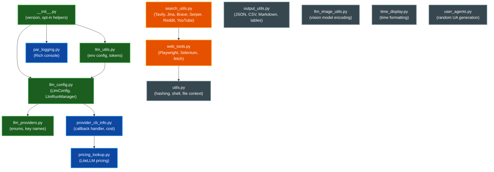

# Architecture Overview

This document describes the module structure and dependencies of PAR AI Core.

## Module Dependency Diagram

The diagram below shows how the public modules depend on each other. Core configuration and provider logic sit at the center; web/search and utility modules build on top.

## Module Descriptions

### Core

| Module | Description |
|--------|-------------|
| `__init__.py` | Package initialization, version string, opt-in helpers (`init_logging`, `apply_nest_asyncio`, `configure_user_agent`) |
| `llm_config.py` | `LlmConfig` dataclass for model configuration and `LlmRunManager` for tracking active model instances. Contains provider-specific builder methods that construct LangChain model objects |
| `llm_providers.py` | `LlmProvider` enum, default model mappings, API key environment variable names, and key-checking utilities |
| `llm_utils.py` | Environment-based config loading (`llm_config_from_env`), token estimation, and text chunking |

### AI Services

| Module | Description |
|--------|-------------|
| `pricing_lookup.py` | LLM cost tracking via LiteLLM's pricing data. `PricingDisplay` enum controls output detail |
| `provider_cb_info.py` | LangChain callback handler (`ParAICallbackHandler`) that tracks token usage, cost, and tool calls across invocations |
| `llm_image_utils.py` | Image encoding utilities for vision models (base64 encoding, URL handling) |

### Web & Search

| Module | Description |
|--------|-------------|
| `web_tools.py` | Web page fetching via Playwright or Selenium, HTML-to-Markdown conversion, parallel URL fetching with proxy and auth support |
| `search_utils.py` | Multi-engine search integration: Tavily, Jina, Brave, Google Serper, Reddit, and YouTube (with transcript fetching and summarization) |

### Output & Utilities

| Module | Description |
|--------|-------------|
| `output_utils.py` | Formatted output display: JSON (syntax-highlighted), CSV (Rich tables), Markdown, and plain text |
| `par_logging.py` | Rich console instances for stdout/stderr output and the opt-in `init_logging()` helper. Attaches a `NullHandler` to the `par_ai` logger on import; it no longer mutates global logging or `sys.excepthook` (call `init_logging()` to opt in) |
| `utils.py` | General utilities: hashing (SHA-256, MD5, SHA-1), shell command execution, file context gathering, stdin detection |
| `time_display.py` | Time formatting and display utilities with Python 3.10+ compatibility |
| `user_agents.py` | Random browser user-agent string generation for web requests |

## Supported Providers

| Provider | BASE | CHAT | EMBEDDINGS | API Key Env Var |
|----------|:----:|:----:|:----------:|-----------------|
| Ollama | Yes | Yes | Yes | — (uses `OLLAMA_HOST`) |
| OpenAI | Yes | Yes | Yes | `OPENAI_API_KEY` |
| Anthropic | — | Yes | — | `ANTHROPIC_API_KEY` |
| Gemini | Yes | Yes | Yes | `GOOGLE_API_KEY` |
| Groq | — | Yes | — | `GROQ_API_KEY` |
| XAI | — | Yes | — | `XAI_API_KEY` |
| Mistral | — | Yes | Yes | `MISTRAL_API_KEY` |
| Deepseek | — | Yes | — | `DEEPSEEK_API_KEY` |
| GitHub | Yes | Yes | Yes | `GITHUB_TOKEN` |
| Azure | Yes | Yes | Yes | `AZURE_OPENAI_API_KEY` |
| Bedrock | Yes | Yes | Yes | `AWS_PROFILE` / `AWS_ACCESS_KEY_ID` |
| OpenRouter | — | Yes | — | `OPENROUTER_API_KEY` |
| LiteLLM | — | Yes | — | (varies by target) |
| LlamaCpp | Yes | Yes | Yes | — (local) |

## Related Documentation

- [Operations Guide](operations.md) — deployment, driver setup, cloud configuration
- [README](../README.md) — quickstart and environment variables
- [CONTRIBUTING](../CONTRIBUTING.md) — development workflow
